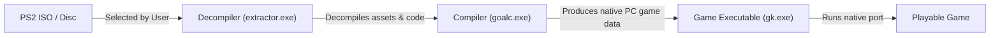
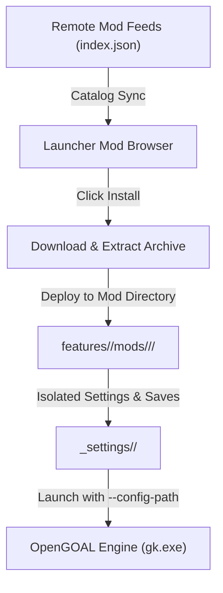
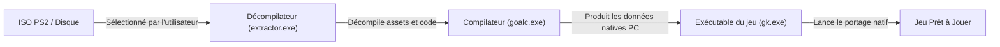
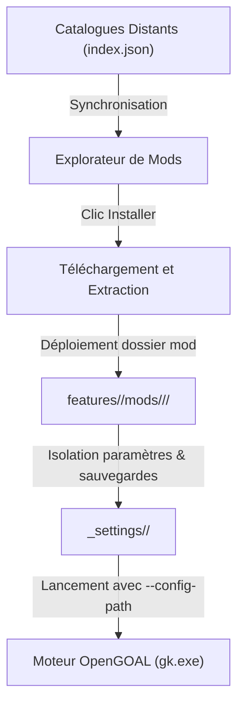

> **Language / Langue :** [🇬🇧 English Version](#-english-version) &nbsp;•&nbsp; [🇫🇷 Version Française](#-version-française)

## Summary / Sommaire

- [🇬🇧 English Version](#-english-version)
  - [1. Overview & Architecture](#1-overview--architecture)
  - [2. Added Features](#2-added-features)
    - [🎮 Save Data Manager](#-save-data-manager)
    - [🎨 Mod Texture Packs Isolation & Management](#-mod-texture-packs-isolation--management)
  - [3. Core Workflows & How They Work](#3-core-workflows--how-they-work)
    - [💿 Game Installation & ISO Extraction Workflow](#-game-installation--iso-extraction-workflow)
    - [🧩 Mod Discovery, Installation & Launch Pipeline](#-mod-discovery-installation--launch-pipeline)
    - [🖼️ Texture Packs Pipeline](#️-texture-packs-pipeline)
    - [🛠️ Developer & CI/CD Workflows](#️-developer--cicd-workflows)
  - [4. Getting Help & Support](#4-getting-help--support)
  - [5. Related Documentation & Deep Dives](#5-related-documentation--deep-dives)
- [🇫🇷 Version Française](#-version-française)
  - [1. Présentation & Architecture](#1-présentation--architecture)
  - [2. Fonctionnalités Ajoutées](#2-fonctionnalités-ajoutées)
    - [🎮 Gestionnaire de Sauvegardes (Save Data Manager)](#-gestionnaire-de-sauvegardes-save-data-manager)
    - [🎨 Gestion & Isolation des Packs de Textures pour Mods](#-gestion--isolation-des-packs-de-textures-pour-mods)
  - [3. Workflows Principaux & Fonctionnement](#3-workflows-principaux--fonctionnement)
    - [💿 Workflow d'Installation du Jeu & Extraction d'ISO](#-workflow-dinstallation-du-jeu--extraction-diso)
    - [🧩 Pipeline de Découverte, Installation & Lancement des Mods](#-pipeline-de-découverte-installation--lancement-des-mods)
    - [🖼️ Pipeline des Packs de Textures](#️-pipeline-des-packs-de-textures)
    - [🛠️ Workflows Développeur & CI/CD](#️-workflows-développeur--cicd)
  - [4. Assistance & Support Technique](#4-assistance--support-technique)
  - [5. Liens & Documentations Complémentaires](#5-liens--documentations-complémentaires)

---

# 🇬🇧 English Version

## 1. Overview & Architecture

The **OpenGOAL Launcher** is a cross-platform desktop application designed to install, manage, update, and run native PC ports of the _Jak and Daxter_ franchise (_Jak and Daxter: The Precursor Legacy_, _Jak II_, and _Jak 3_), along with community mods and custom texture packs.

For the original project documentation, see [original_project_readme.md](./original_project_readme.md).

```
┌─────────────────────────────────────────────────────────────────┐
│                     Frontend (Svelte 5 UI)                      │
│        Modern Runes ($state, $derived), Tailwind CSS v4         │
└────────────────────────────────┬────────────────────────────────┘
                                 │ Tauri IPC Commands / Events
┌────────────────────────────────▼────────────────────────────────┐
│                      Backend (Rust & Tauri v2)                  │
│       Process management, file operations, configuration        │
└────────────────────────────────┬────────────────────────────────┘
                                 │ Executables & Filesystem
┌────────────────────────────────▼────────────────────────────────┐
│                      Native OpenGOAL Engine                     │
│      extractor (ISO decompile), goalc (compiler), gk (game)     │
└─────────────────────────────────────────────────────────────────┘
```

### Technology Highlights

- **Desktop Runtime**: [Tauri v2](https://tauri.app/) (Rust backend handling native process execution, file I/O, and secure OS interactions).
- **Frontend Framework**: [Svelte 5](https://svelte.dev/) utilizing modern runes (`$state`, `$derived`, `$props`, `$effect`).
- **Styling**: [Tailwind CSS v4](https://tailwindcss.com/) & [Flowbite Svelte](https://flowbite-svelte.com/).
- **Bundler**: [Vite](https://vitejs.dev/) with TypeScript.
- **Game Engine**: [OpenGOAL](https://github.com/open-goal/jak-project) native runtime (`gk`), compiler (`goalc`), and decompiler/asset extractor (`extractor`).

---

## 2. Added Features

### 🎮 Save Data Manager

The **Save Data Manager** provides an integrated, safe, and intuitive interface to inspect, copy, move, backup, and delete game saves across all installations (base vanilla games and installed community mods).

- **Multi-Game Switching**: Instantly switch between Jak 1, Jak 2, and Jak 3 directly within the manager using the top selector bar.
- **Regional Directory Support**: Automatically scans regional save subdirectories (e.g. `BASCUS-97265AYBABTU!`, `BESCES-51608AYBABTU!`, `default`).
- **Multi-Install Visibility**: Displays save slots for both the vanilla game and every installed mod with active slot indicators.
- **Milestone Recognition**: Detects and displays the furthest completed tasks or areas (e.g. Geyser Rock, Forbidden Jungle) on save slot cards.
- **Safe Transfers & Automatic Backups**: Copy or move saves between different installations or folders. Overwriting an existing slot automatically creates a timestamped `.bak` backup file.
- **Deletion Safeguard**: Dedicated confirmation dialog before deleting save files to prevent accidental loss.
- **Direct Explorer Access**: One-click button to open the active save folder in the operating system file explorer.

> Detailed documentation: [docs/features_ai/features_save_data_manager.md](./docs/features_ai/features_save_data_manager.md)

---

### 🎨 Mod Texture Packs Isolation & Management

In the original launcher, texture packs only targeted the base game. This feature introduces dedicated support and complete isolation for community mod textures:

- **Dedicated Management Screen**: Clicking "Texture Packs" from a mod dashboard opens a dedicated UI (`/:game_name/mods/:source_name/:mod_name/texture_packs`) listing packs affiliated with that mod.
- **Automatic Detection & Installation**: When installing or updating a mod whose release catalog (`index.json`) declares texture packs, the launcher automatically downloads and enables them for that mod.
- **Total Isolation**: Mod textures are extracted directly into the mod's custom assets directory (`features/<game>/mods/<source>/<mod>/data/custom_assets/.../texture_replacements/`). They never affect the base game or other mods.
- **Immediate Decompilation**: Textures are compiled into the mod data during installation, ensuring they work out-of-the-box without manual re-extraction.
- **Toggle & Re-apply**: Players can activate or deactivate individual packs at any time and re-apply changes with one click.

> Detailed documentation: [docs/features_ai/feature_modTextures.md](./docs/features_ai/feature_modTextures.md)

---

## 3. Core Workflows & How They Work

### 💿 Game Installation & ISO Extraction Workflow

To play a game, the launcher requires an authentic, legally owned PlayStation 2 copy or ISO image:



1. **Selection**: The user selects a valid PS2 ISO or disc for Jak 1, Jak 2, or Jak 3.
2. **Extraction & Decompilation**: The launcher invokes `extractor.exe` to validate the disc image, extract game assets, and decompile GOAL code.
3. **Compilation**: `goalc.exe` compiles assets into native PC data within the game's active data folder.
4. **Execution**: The launcher launches the game runtime (`gk.exe`) with the appropriate configuration flags.

---

### 🧩 Mod Discovery, Installation & Launch Pipeline

The modding pipeline enables community mod developers to distribute custom experiences seamlessly:



1. **Catalog Aggregation**: Remote mod sources defined in launcher settings provide an `index.json` schema listing available mods, versions, and dependencies.
2. **Installation**: Mod archives are downloaded and extracted into their dedicated directory: `<install_dir>/features/<game>/mods/<source>/<mod_name>/`.
3. **Environment Isolation**: Mod configuration and save files are strictly isolated under `_settings/<mod_name>/`.
4. **Launch Command**: Mods are executed using `gk.exe --config-path <mod_settings_dir>`, guaranteeing that vanilla saves and settings remain untouched.

---

### 🖼️ Texture Packs Pipeline

Texture packs replace original textures with high-definition or custom community artwork:

- **Vanilla Texture Packs**: Installed into `features/<game>/texture-packs/<pack_name>/` and deployed into the base game's active custom assets folder (`active/<game>/data/custom_assets/...`).
- **Mod Texture Packs**: Deployed exclusively into the target mod's custom assets directory (`features/<game>/mods/<source>/<mod>/data/custom_assets/...`).
- **Decompilation & Re-baking**: When packs are enabled or disabled, the launcher recompiles the asset trees so the engine loads the new textures immediately.

---

### 🛠️ Developer & CI/CD Workflows

#### Local Development Setup

Prerequisites: **Rust** toolchain (`cargo`) and **Node.js** (LTS).

```bash
# 1. Install frontend dependencies
npx yarn install

# 2. Run in development mode (Rust backend + Svelte 5 with live reload)
npx yarn tauri dev

# 3. Typecheck frontend code (svelte-check)
npx yarn typecheck

# 4. Check code formatting (Prettier)
npx yarn check-format

# 5. Run backend Rust tests
cd src-tauri && cargo test
```

#### GitHub Actions Automated Pipelines

The repository features 4 automated CI/CD workflows (`.github/workflows/`):

| Workflow       | File           | Trigger              | Responsibility                                                                         |
| :------------- | :------------- | :------------------- | :------------------------------------------------------------------------------------- |
| **🔨 Build**   | `build.yaml`   | Pushes/PRs to `main` | Cross-compiles on Linux (Ubuntu 24.04), Windows, macOS Apple Silicon, and macOS Intel. |
| **📝 Linter**  | `lint.yaml`    | Pushes/PRs to `main` | Runs `svelte-check`, Prettier format validation, `cargo fmt`, and Clippy.              |
| **🧪 Tests**   | `test.yaml`    | Pushes/PRs to `main` | Executes frontend Vitest test suites.                                                  |
| **🏭 Release** | `release.yaml` | Manual dispatch      | Bumps version tags, drafts GitHub releases, and attaches compiled platform installers. |

> Detailed documentation: [docs/github-workflow.md](./docs/github-workflow.md)

---

## 4. Getting Help & Support

When reporting an issue, generate a **Support Package** from the launcher settings to bundle diagnostic logs and system details:


If the application cannot open, log files are stored in the following standard directories:

- **Windows**: `C:\Users\<USER>\AppData\Roaming\OpenGOAL-Launcher\logs`
- **Linux**: `/home/<USER>/.config/OpenGOAL-Launcher/logs`
- **macOS**: `/Users/<USER>/Library/Logs/OpenGOAL-Launcher/app/logs`

---

## 5. Related Documentation & Deep Dives

- [original_project_readme.md](./original_project_readme.md) — The original OpenGOAL Launcher README.
- [docs/features_ai/features_save_data_manager.md](./docs/features_ai/features_save_data_manager.md) — Save Data Manager architecture and user guide.
- [docs/features_ai/feature_modTextures.md](./docs/features_ai/feature_modTextures.md) — Mod texture packs isolation and pipeline.
- [docs/project-technologies.md](./docs/project-technologies.md) — In-depth overview of the technical stack (Rust, Svelte 5, Tauri v2).
- [docs/github-workflow.md](./docs/github-workflow.md) — Full description of CI/CD GitHub Actions pipelines.

---

# 🇫🇷 Version Française

## 1. Présentation & Architecture

Le **Launcher OpenGOAL** est une application de bureau multiplateforme conçue pour installer, gérer, mettre à jour et exécuter les portages PC natifs de la franchise _Jak and Daxter_ (_Jak and Daxter: The Precursor Legacy_, _Jak II_, et _Jak 3_), ainsi que les mods communautaires et les packs de textures personnalisés.

Pour consulter la documentation d'origine du projet, rendez-vous sur [original_project_readme.md](./original_project_readme.md).

```
┌─────────────────────────────────────────────────────────────────┐
│                    Frontend (Interface Svelte 5)                │
│         Runes modernes ($state, $derived), Tailwind CSS v4      │
└────────────────────────────────┬────────────────────────────────┘
                                 │ Commandes / Événements IPC Tauri
┌────────────────────────────────▼────────────────────────────────┐
│                     Backend (Rust & Tauri v2)                   │
│       Gestion des processus, opérations disque, configuration   │
└────────────────────────────────┬────────────────────────────────┘
                                 │ Exécutables natifs & Système de fichiers
┌────────────────────────────────▼────────────────────────────────┐
│                     Moteur Natif OpenGOAL                       │
│     extractor (décompilation ISO), goalc (compilateur), gk (jeu)│
└─────────────────────────────────────────────────────────────────┘
```

### Technologies Clés

- **Environnement Desktop** : [Tauri v2](https://tauri.app/) (backend Rust gérant l'exécution de processus natifs, les entrées/sorties fichiers et les accès sécurisés au système d'exploitation).
- **Framework Frontend** : [Svelte 5](https://svelte.dev/) exploitant les runes modernes (`$state`, `$derived`, `$props`, `$effect`).
- **Habillage & Styles** : [Tailwind CSS v4](https://tailwindcss.com/) & [Flowbite Svelte](https://flowbite-svelte.com/).
- **Outil de Bundling** : [Vite](https://vitejs.dev/) avec TypeScript.
- **Moteur de Jeu** : [OpenGOAL](https://github.com/open-goal/jak-project) avec son runtime natif (`gk`), son compilateur (`goalc`) et son extracteur/décompilateur d'assets (`extractor`).

---

## 2. Fonctionnalités Ajoutées

### 🎮 Gestionnaire de Sauvegardes (Save Data Manager)

Le **Gestionnaire de Sauvegardes** propose une interface sécurisée, centralisée et intuitive pour inspecter, copier, déplacer, sauvegarder et supprimer les sauvegardes de jeu à travers toutes vos installations (jeu de base officiel et mods installés).

- **Sélecteur Multi-Jeux** : Basculez en un clic entre Jak 1, Jak 2 et Jak 3 directement depuis la barre supérieure du gestionnaire.
- **Prise en charge des Dossiers Régionaux** : Détection et affichage automatique des sous-dossiers de sauvegardes régionaux (ex. `BASCUS-97265AYBABTU!`, `BESCES-51608AYBABTU!`, `default`).
- **Visibilité Multi-Installations** : Affiche les emplacements de sauvegardes pour le jeu de base ainsi que pour chacun de vos mods avec des indicateurs d'état en temps réel.
- **Reconnaissance des Objectifs (Milestones)** : Analyse et affiche les dernières étapes validées en jeu (ex. Geyser Rock, Forbidden Jungle) directement sur les cartes d'emplacements de sauvegarde.
- **Transferts Sécurisés & Backups Automatiques** : Copiez ou déplacez vos sauvegardes entre différentes installations ou dossiers. Tout écrasement d'un emplacement existant génère automatiquement une sauvegarde horodatée (`.bak`).
- **Protection Anti-Suppression Accidentelle** : Modale de confirmation dédiée avant toute suppression définitive pour éviter les pertes de données.
- **Accès Direct à l'Explorateur** : Bouton permettant d'ouvrir directement le dossier de sauvegarde actif dans l'explorateur de fichiers de votre système d'exploitation.

> Documentation complète : [docs/features_ai/features_save_data_manager.md](./docs/features_ai/features_save_data_manager.md)

---

### 🎨 Gestion & Isolation des Packs de Textures pour Mods

Dans la version d'origine du launcher, les packs de textures étaient réservés au jeu de base. Cette fonctionnalité apporte une gestion dédiée et une isolation totale pour les mods communautaires :

- **Écran de Gestion Dédié** : Cliquer sur « Packs de textures » depuis la page d'un mod ouvre un écran dédié (`/:game_name/mods/:source_name/:mod_name/texture_packs`) recensant les packs associés à ce mod.
- **Détection & Installation Automatique** : Lors de l'installation ou de la mise à jour d'un mod dont le catalogue (`index.json`) référence des textures associées, le launcher les télécharge et les applique automatiquement.
- **Isolation Totale** : Les textures d'un mod sont déployées exclusivement dans son dossier privé (`features/<game>/mods/<source>/<mod>/data/custom_assets/.../texture_replacements/`). Elles ne modifient jamais le jeu de base ni les autres mods.
- **Décompilation Immédiate** : Les textures sont intégrées et compilées dès l'installation du mod pour une expérience prête à l'emploi.
- **Activation à la Demande** : Les joueurs peuvent à tout moment activer ou désactiver des packs individuellement et réappliquer les modifications en un clic.

> Documentation complète : [docs/features_ai/feature_modTextures.md](./docs/features_ai/feature_modTextures.md)

---

## 3. Workflows Principaux & Fonctionnement

### 💿 Workflow d'Installation du Jeu & Extraction d'ISO

Pour fonctionner, le launcher s'appuie sur une copie authentique et légalement acquise du jeu PlayStation 2 :



1. **Sélection** : L'utilisateur indique son fichier ISO ou son disque PS2 pour Jak 1, Jak 2 ou Jak 3.
2. **Extraction & Décompilation** : Le launcher exécute `extractor.exe` pour vérifier la conformité du média, extraire les ressources graphiques et sonores et décompiler le code GOAL.
3. **Compilation** : `goalc.exe` compile les assets en données natives optimisées dans le dossier actif du jeu.
4. **Exécution** : Le launcher démarre le moteur de jeu (`gk.exe`) avec les paramètres de configuration adaptés.

---

### 🧩 Pipeline de Découverte, Installation & Lancement des Mods

Le système de modding permet d'installer facilement les créations de la communauté :



1. **Agrégation des Catalogues** : Les sources de mods configurées fournissent un flux JSON (`index.json`) décrivant les versions, dépendances et ressources disponibles.
2. **Installation** : L'archive du mod est téléchargée et extraite dans son répertoire dédié : `<install_dir>/features/<game>/mods/<source>/<mod_name>/`.
3. **Isolation de l'Environnement** : Les paramètres et sauvegardes propres au mod sont stockés dans `_settings/<mod_name>/`.
4. **Commande de Lancement** : Le jeu est lancé avec l'argument `--config-path <dossier_settings_mod>`, assurant l'étanchéité complète vis-à-vis du jeu de base et des autres mods.

---

### 🖼️ Pipeline des Packs de Textures

Les packs de textures remplacent les textures originales par des versions haute définition ou des styles artistiques personnalisés :

- **Packs pour le Jeu de Base** : Installés dans `features/<game>/texture-packs/<nom_pack>/` puis déployés dans le dossier d'assets actif du jeu (`active/<game>/data/custom_assets/...`).
- **Packs pour les Mods** : Déployés spécifiquement dans le sous-dossier d'assets personnalisés du mod ciblé (`features/<game>/mods/<source>/<mod>/data/custom_assets/...`).
- **Recompilation & Application** : Lors de chaque changement, le launcher réactualise les données compilées pour que le moteur prenne en compte les nouvelles textures immédiatement.

---

### 🛠️ Workflows Développeur & CI/CD

#### Configuration de l'Environnement Local

Prérequis : Chaîne d'outils **Rust** (`cargo`) et **Node.js** (version LTS).

```bash
# 1. Installer les dépendances du frontend
npx yarn install

# 2. Lancer l'environnement de développement complet (Rust + Svelte 5 avec rechargement à chaud)
npx yarn tauri dev

# 3. Vérifier les types TypeScript et Svelte (svelte-check)
npx yarn typecheck

# 4. Vérifier le formatage du code (Prettier)
npx yarn check-format

# 5. Lancer les tests Rust côté backend
cd src-tauri && cargo test
```

#### Pipelines d'Intégration Continue (GitHub Actions)

Le dépôt dispose de 4 workflows automatisés (`.github/workflows/`) :

| Workflow       | Fichier        | Déclencheur           | Rôle                                                                                                  |
| :------------- | :------------- | :-------------------- | :---------------------------------------------------------------------------------------------------- |
| **🔨 Build**   | `build.yaml`   | Push / PR vers `main` | Compilation multiplateforme sur Linux (Ubuntu 24.04), Windows, macOS Apple Silicon et macOS Intel.    |
| **📝 Linter**  | `lint.yaml`    | Push / PR vers `main` | Exécute `svelte-check`, vérifie le formatage Prettier, applique `cargo fmt` et le linter Rust Clippy. |
| **🧪 Tests**   | `test.yaml`    | Push / PR vers `main` | Exécute la suite de tests automatisés Vitest côté frontend.                                           |
| **🏭 Release** | `release.yaml` | Déclenchement manuel  | Incrémente la version, génère la release GitHub et compile les installateurs finaux.                  |

> Documentation complète : [docs/github-workflow.md](./docs/github-workflow.md)

---

## 4. Assistance & Support Technique

Pour signaler un dysfonctionnement, générez un **Support Package** depuis les paramètres de l'application afin d'inclure les journaux et diagnostics :


Si le launcher ne démarre pas, vous pouvez accéder manuellement aux fichiers de logs dans les dossiers suivants :

- **Windows** : `C:\Users\<VOTRE_NOM>\AppData\Roaming\OpenGOAL-Launcher\logs`
- **Linux** : `/home/<VOTRE_NOM>/.config/OpenGOAL-Launcher/logs`
- **macOS** : `/Users/<VOTRE_NOM>/Library/Logs/OpenGOAL-Launcher/app/logs`

---

## 5. Liens & Documentations Complémentaires

- [original_project_readme.md](./original_project_readme.md) — Le README d'origine du projet OpenGOAL Launcher.
- [docs/features_ai/features_save_data_manager.md](./docs/features_ai/features_save_data_manager.md) — Guide et architecture du Gestionnaire de Sauvegardes.
- [docs/features_ai/feature_modTextures.md](./docs/features_ai/feature_modTextures.md) — Guide et fonctionnement de l'isolation des textures de mods.
- [docs/project-technologies.md](./docs/project-technologies.md) — Présentation détaillée des technologies du projet (Rust, Svelte 5, Tauri v2).
- [docs/github-workflow.md](./docs/github-workflow.md) — Description détaillée des pipelines GitHub Actions.
