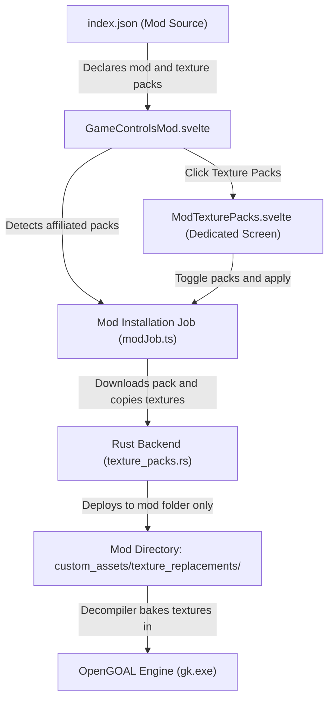
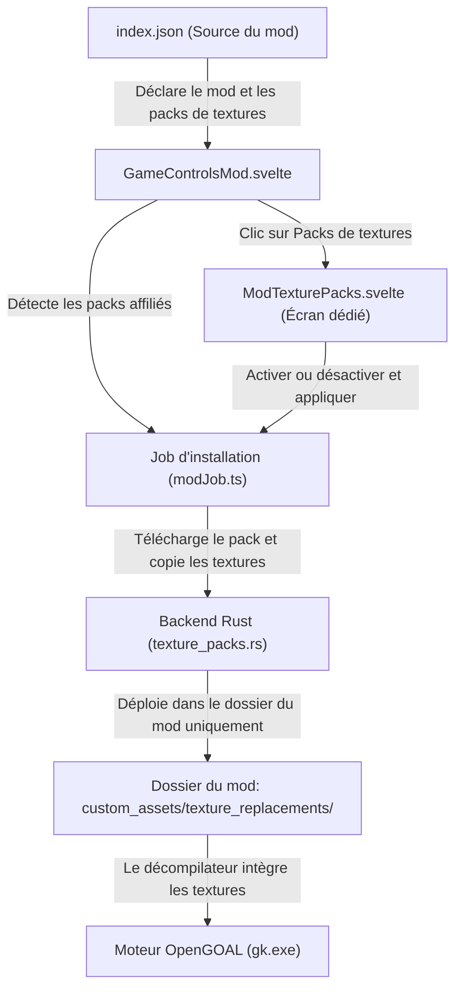

> **Language / Langue :** [🇬🇧 English Version](#-english-version) &nbsp;•&nbsp; [🇫🇷 Version Française](#-version-française)

## Summary / Sommaire

- [🇬🇧 English Version](#-english-version)
  - [1. What This Feature Brings](#1-what-this-feature-brings)
  - [2. How the Feature Works](#2-how-the-feature-works)
  - [3. How it Integrates into the Architecture](#3-how-it-integrates-into-the-architecture)
  - [4. New Files Created](#4-new-files-created)
  - [5. Overview of Changes from the Original Project](#5-overview-of-changes-from-the-original-project)
- [🇫🇷 Version Française](#-version-française)
  - [1. Qu'est-ce qu'elle apporte](#1-quest-ce-quelle-apporte)
  - [2. Comment fonctionne la fonctionnalité](#2-comment-fonctionne-la-fonctionnalité)
  - [3. Comment elle s'intègre dans l'architecture](#3-comment-elle-sintègre-dans-larchitecture)
  - [4. Quels sont les nouveaux fichiers](#4-quels-sont-les-nouveaux-fichiers)
  - [5. Quels sont les modifications dans les grandes lignes](#5-quels-sont-les-modifications-dans-les-grandes-lignes)

---

# 🇬🇧 English Version

## 1. What This Feature Brings

In the original OpenGOAL Launcher, texture packs were designed solely for the base (vanilla) game. If a mod creator wanted custom textures (e.g. snowy terrain, redesigned armor, or HD interface elements), they had no official way to tie those textures exclusively to their mod without either overwriting vanilla game textures or affecting other mods.

This feature introduces:

1. **Automatic Installation**: When a mod author includes texture packs in their mod release (cataloged in `index.json`), the launcher automatically detects, downloads, and enables those texture packs specifically for that mod when clicking "Install" or "Update".
2. **Total Isolation**: Textures enabled for a mod run **only** inside that mod. They never alter or bleed into the base game or into other installed mods.
3. **Dedicated Management Screen**: Clicking "Texture Packs" on a mod's page opens a dedicated, user-friendly screen showcasing all texture packs affiliated with that mod, allowing players to view artwork, read descriptions, and toggle them on or off individually.

---

## 2. How the Feature Works

To understand how it works in plain terms, imagine the lifecycle of a mod from installation to gameplay:

1. **Detection in the Catalog (`index.json`)**:
   - Each mod source provides an `index.json` file declaring available mods and texture packs.
   - When you view or install a mod, the launcher scans `texturePacks` in `index.json` to find packs affiliated with this mod (matching release URLs, mod tags, or mod names).
2. **Download and Unpacking**:
   - The launcher downloads the texture pack `.zip` archive into the launcher's texture library (`features/<game>/texture-packs/<pack_name>/`).
3. **Mod-Specific Texture Deployment**:
   - Instead of putting textures in the base game folder, the launcher copies them directly into the target mod's private folder (`features/<game>/mods/<source>/<mod>/data/custom_assets/.../texture_replacements/`).
4. **Immediate Decompilation**:
   - During mod installation, OpenGOAL's decompiler (`extractor.exe`) reads these replacement textures and compiles them into the mod's game data immediately. No manual recompilation is needed!
5. **Browsing and Customizing**:
   - At any time, clicking "Texture Packs" on the mod dashboard displays the dedicated screen with full pack details (artwork, version, author, description, and status badges). Users can activate or deactivate packs and apply changes with one click.

---

## 3. How it Integrates into the Architecture

The OpenGOAL Launcher architecture consists of two main layers: a **Rust backend** (`src-tauri/`) and a **Svelte 5 frontend** (`src/`). Here is how this feature fits naturally into that existing structure:

- **Runtime Execution (`gk`)**: The game engine executable loads textures from `./data` relative to its working directory. Because mods run from their own folder (`features/<game>/mods/<source>/<mod>/`), mod textures are completely separated from the vanilla game (`active/<game>/data/`).
- **Configuration Storage (`settings.json`)**: Each installed mod has an `InstalledMod` record. We added `texture_packs: Vec<String>` to store which packs are enabled for that specific mod, leaving `GameConfig.texture_packs` untouched.
- **IPC Commands**: Clean Tauri backend commands (`update_mod_texture_pack_data`, `download_and_extract_texture_pack`, `set_mod_texture_packs`) communicate between Svelte and Rust.

---

## 4. New Files Created

To keep the codebase modular and avoid bloating existing components, new dedicated files were created:

1. [src/components/texture-packs/ModTexturePacks.svelte](../../src/components/texture-packs/ModTexturePacks.svelte):
   - Dedicated frontend screen displayed when clicking "Texture Packs" from a mod page.
   - Shows affiliated pack cards, status badges, local ZIP import, and apply buttons.
2. [docs/features_documentation/feature_modTextures.md](./feature_modTextures.md):
   - This accessible pedagogical documentation explaining the feature's role and integration.

---

## 5. Overview of Changes from the Original Project

Here is a summary of what was adjusted across the existing codebase:

- **Backend Configuration ([src-tauri/src/config.rs](../../src-tauri/src/config.rs))**:
  - Added helper methods to read and write active texture packs on a mod's config (`get_mod_texture_packs`, `set_mod_texture_packs`).
  - Preserved existing mod settings when reinstalling or updating.
- **Backend File Operations ([src-tauri/src/commands/features/texture_packs.rs](../../src-tauri/src/commands/features/texture_packs.rs))**:
  - Added `download_and_extract_texture_pack` to download remote texture pack archives.
  - Added `update_mod_texture_pack_data` to copy textures into the mod's custom assets folder.
- **Mod Installation Pipeline ([src/lib/job/modJob.ts](../../src/lib/job/modJob.ts))**:
  - Updated `setupModInstallation` so that if affiliated texture packs are detected, they are downloaded, enabled, and deployed before decompilation runs.
- **Routing ([src/router.ts](../../src/router.ts))**:
  - Pointed `/:game_name/mods/:source_name/:mod_name/texture_packs` to the new `ModTexturePacks.svelte` component, while leaving the vanilla route `/:game_name/texture_packs` to [TexturePacks.svelte](../../src/components/texture-packs/TexturePacks.svelte).
- **Mod Controls ([src/components/games/GameControlsMod.svelte](../../src/components/games/GameControlsMod.svelte))**:
  - Enabled the "Texture Packs" button.
  - Added automatic detection of release-affiliated packs when clicking "Install" or "Update".
- **Translations ([src/assets/translations/](../../src/assets/translations/))**:
  - Added `features_modTextures_*` localization keys across all 35 supported languages.

---

# 🇫🇷 Version Française

## 1. Qu'est-ce qu'elle apporte

Dans la version initiale de l'OpenGOAL Launcher, les packs de textures étaient exclusivement conçus pour le jeu de base officiel (vanilla). Si un créateur de mod souhaitait proposer des textures personnalisées (comme des décors enneigés, des armures recolorées ou une interface haute définition), il n'existait aucun moyen officiel de lier ces textures uniquement à son mod sans impacter le jeu de base ou les autres mods.

Cette fonctionnalité apporte trois améliorations majeures :

1. **Installation Automatique** : lorsqu'un créateur de mod associe un pack de textures à sa release (référencé dans `index.json`), le lanceur le détecte, le télécharge et l'active automatiquement pour ce mod lors de son installation.
2. **Isolation Complète** : les textures activées pour un mod s'exécutent **exclusivement** pour ce mod. Elles ne modifient jamais le jeu de base ni les autres mods installés.
3. **Écran de Gestion Dédié** : en cliquant sur "Packs de textures" depuis la page d'un mod, un écran clair et accessible présente tous les packs affiliés, leurs illustrations, descriptions et versions, avec la possibilité de les activer ou désactiver individuellement.

---

## 2. Comment fonctionne la fonctionnalité

Pour comprendre le fonctionnement de manière simple, voici le cheminement pas à pas :

1. **Détection dans le catalogue (`index.json`)** :
   - Chaque source de mods fournit un fichier `index.json` qui liste les mods et les packs de textures disponibles.
   - Le lanceur examine `texturePacks` dans `index.json` et repère les packs affiliés au mod (grâce à l'URL de téléchargement de la release, aux tags ou au nom du mod).
2. **Téléchargement et Décompression** :
   - Le lanceur télécharge l'archive `.zip` du pack de texture dans la bibliothèque de textures (`features/<game>/texture-packs/<pack_name>/`).
3. **Déploiement Isolé dans le Mod** :
   - Plutôt que de copier les textures dans le jeu vanilla, le lanceur les copie directement dans le dossier privé du mod (`features/<game>/mods/<source>/<mod>/data/custom_assets/.../texture_replacements/`).
4. **Décompilation Immédiate** :
   - Lors de l'installation du mod, l'extracteur OpenGOAL (`extractor.exe`) lit ces textures de remplacement et les compile directement dans les données du mod. Aucune manipulation manuelle supplémentaire n'est requise !
5. **Consultation et Personnalisation** :
   - À tout moment, le bouton "Packs de textures" sur la page du mod ouvre un écran dédié listant chaque pack avec son statut (`ACTIF`, `En ligne`, `Téléchargé`). Le joueur peut ainsi ajuster ses préférences en un clic.

---

## 3. Comment elle s'intègre dans l'architecture

L'OpenGOAL Launcher repose sur deux piliers : un **moteur natif Rust** (`src-tauri/`) et une **interface web Svelte 5** (`src/`). Cette fonctionnalité s'intègre naturellement dans cette organisation :

- **Moteur de jeu (`gk`)** : le moteur OpenGOAL charge ses données depuis `./data` relativement à son dossier de travail. Comme chaque mod s'exécute dans son propre répertoire (`features/<game>/mods/<source>/<mod>/`), ses textures sont strictement isolées de celles du jeu vanilla (`active/<game>/data/`).
- **Stockage de Configuration (`settings.json`)** : chaque mod installé possède un objet `InstalledMod`. Nous y avons ajouté `texture_packs: Vec<String>` pour mémoriser les packs actifs de ce mod, sans jamais altérer `GameConfig.texture_packs` du jeu vanilla.
- **Commandes IPC** : des fonctions Tauri concises (`update_mod_texture_pack_data`, `download_and_extract_texture_pack`, `set_mod_texture_packs`) assurent le dialogue sécurisé entre l'interface Svelte et le moteur Rust.

---

## 4. Quels sont les nouveaux fichiers

Pour préserver la clarté du projet et éviter de surcharger les composants existants, deux fichiers dédiés ont été créés :

1. [src/components/texture-packs/ModTexturePacks.svelte](../../src/components/texture-packs/ModTexturePacks.svelte) :
   - Écran dédié qui s'affiche lors du clic sur "Packs de textures" depuis la page d'un mod.
   - Présente les fiches des packs affiliés, leurs illustrations, badges d'état, boutons d'activation et import de ZIP local.
2. [docs/features_documentation/feature_modTextures.md](./feature_modTextures.md) :
   - Ce document pédagogique expliquant la fonctionnalité de manière simple et accessible.

---

## 5. Quels sont les modifications dans les grandes lignes

Voici une vue d'ensemble des modifications apportées au projet initial :

- **Configuration Backend ([src-tauri/src/config.rs](../../src-tauri/src/config.rs))** :
  - Ajout des méthodes pour lire et persister la liste des packs actifs par mod (`get_mod_texture_packs`, `set_mod_texture_packs`).
  - Préservation des paramètres existants du mod lors des mises à jour.
- **Gestion des Fichiers Backend ([src-tauri/src/commands/features/texture_packs.rs](../../src-tauri/src/commands/features/texture_packs.rs))** :
  - Ajout de `download_and_extract_texture_pack` pour télécharger et extraire les archives de packs.
  - Ajout de `update_mod_texture_pack_data` pour copier les textures dans le répertoire du mod.
- **Pipeline d'Installation ([src/lib/job/modJob.ts](../../src/lib/job/modJob.ts))** :
  - Évolution de `setupModInstallation` pour télécharger, activer et déployer automatiquement les packs affiliés avant l'étape de décompilation.
- **Routage ([src/router.ts](../../src/router.ts))** :
  - La route `/:game_name/mods/:source_name/:mod_name/texture_packs` ouvre `ModTexturePacks.svelte`, tandis que la route vanilla conserve [TexturePacks.svelte](../../src/components/texture-packs/TexturePacks.svelte).
- **Page du Mod ([src/components/games/GameControlsMod.svelte](../../src/components/games/GameControlsMod.svelte))** :
  - Décommentage et activation du bouton "Packs de textures".
  - Détection automatique des packs affiliés lors du clic sur "Installer" ou "Mettre à jour".
- **Traductions ([src/assets/translations/](../../src/assets/translations/))** :
  - Intégration des clés `features_modTextures_*` dans l'ensemble des 35 langues de l'application.
