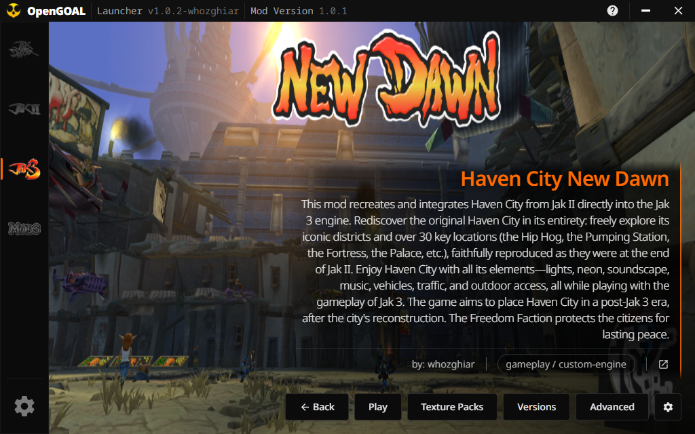
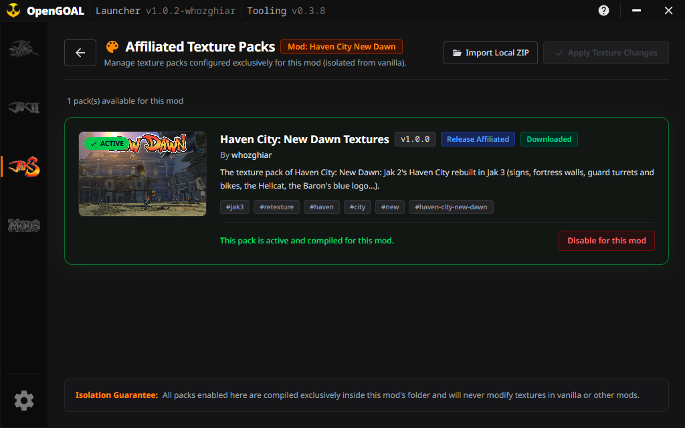
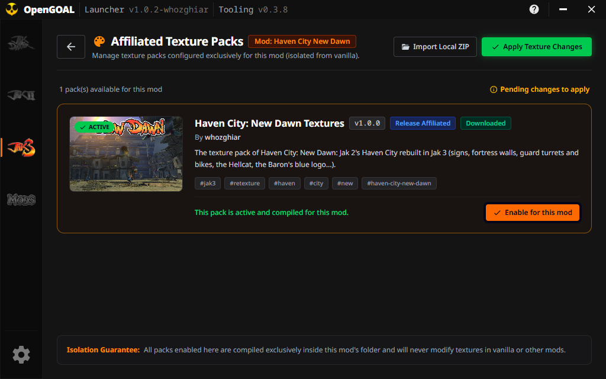
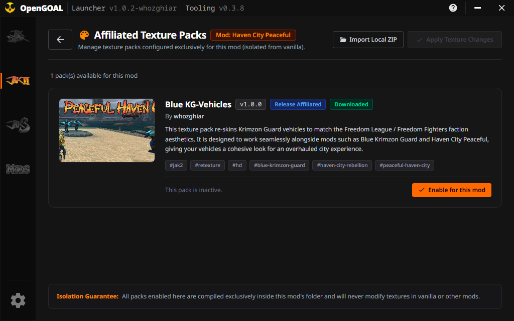
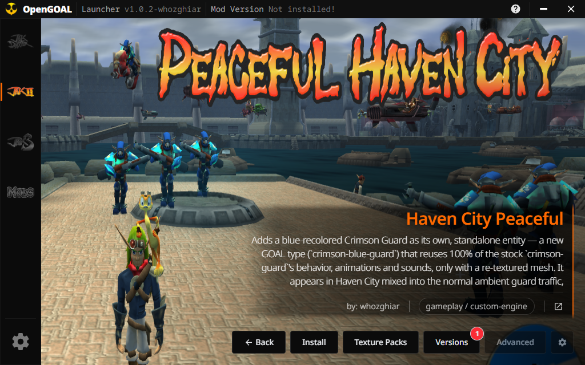
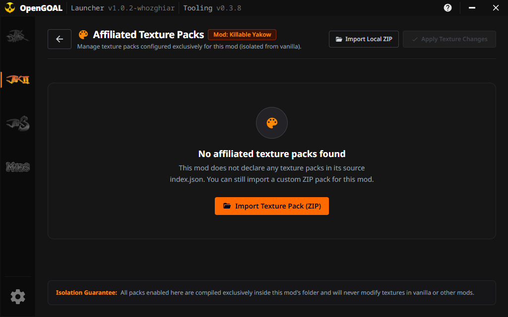

# Mod Texture Packs

A texture pack replaces in-game textures with PNG files. This feature lets each mod have its own texture packs, installed with the mod and kept apart from the base game and from other mods.

Screenshots in this document come from launcher 1.0.2 built from `master-dev`, on Windows.

## Contents

- [1. What this feature brings](#1-what-this-feature-brings)
- [2. How the feature works](#2-how-the-feature-works)
- [3. How it integrates into the architecture](#3-how-it-integrates-into-the-architecture)
- [4. New files created](#4-new-files-created)
- [5. Overview of changes from the original project](#5-overview-of-changes-from-the-original-project)

## 1. What this feature brings

In the original launcher, texture packs only applied to the base game. They were copied into the base game data folder (`active/<game>/data/custom_assets/...`). A mod runs from its own folder with its own data, so those packs never reached it. A mod author who wanted custom textures had no supported way to ship them with the mod.

This feature adds:

- **Per-mod packs**: each installed mod keeps its own list of enabled packs. The base game keeps a separate list.
- **Automatic installation**: if the mod source declares texture packs for a mod, installing or updating the mod also downloads and enables them.
- **Isolation**: textures enabled for a mod are copied into that mod's folder only. The base game and other mods never see them.
- **A dedicated screen**: a **Texture Packs** page on each mod shows the packs available for it and lets you turn them on or off.

## 2. How the feature works

### Vocabulary

- **Texture pack**: a ZIP file containing `custom_assets/<game>/texture_replacements/` with PNG files named after the textures they replace. Extracted packs are stored in a shared library, `features/<game>/texture-packs/<pack name>/`.
- **Mod source**: a JSON feed (`index.json`) that lists mods and texture packs. Its format is defined in [schemas/mod-source/v1/](../../schemas/mod-source/v1/).
- **Affiliated pack**: a pack that the mod source links to a given mod.

### Opening the screen

Open a mod from the **Mods** list. The **Texture Packs** button sits next to **Play**.

### Reading the screen

The page lists the packs available for this mod.

At the top:

- The arrow goes back to the mod page.
- The orange tag names the mod the page applies to.
- **Import Local ZIP** adds a pack from a ZIP file on your disk.
- **Apply Texture Changes** is grey until you change something.

On each pack card:

| Element                                            | Meaning                                                                 |
| :------------------------------------------------- | :---------------------------------------------------------------------- |
| Green **ACTIVE** label on the cover                | The pack is applied to this mod now.                                    |
| **Release Affiliated**                             | The mod source links this pack to this mod.                             |
| **Downloaded**                                     | The pack is already in the texture library of this game.                |
| **Online**                                         | The pack is not downloaded yet. It will be downloaded when you apply.   |
| Tags                                               | The tags declared by the pack author.                                   |
| Status line                                        | Says whether the pack is active and compiled for this mod, or inactive. |
| **Disable for this mod** / **Enable for this mod** | Turns the pack off or on, without applying yet.                         |

The border of a card also carries meaning: green for an applied pack, orange for a pack you changed and have not applied, grey for an inactive pack.

The note at the bottom of the page recalls that packs enabled here are compiled inside this mod's folder only.

### Turning a pack on or off

Click **Disable for this mod**. Nothing happens to the mod yet. The page only records your choice.

- The card turns orange and the button becomes **Enable for this mod**.
- **Pending changes to apply** appears above the list.
- **Apply Texture Changes** turns green.
- The **ACTIVE** label and the status line still describe the applied state until you apply.

Click the button again to undo the change. Leaving the page discards pending changes.

Click **Apply Texture Changes** to apply. The launcher then:

1. Downloads every enabled pack that is not in the library yet.
2. Opens a progress screen and runs four steps: save the list of enabled packs for the mod, copy the textures into the mod, decompile, compile.
3. Returns to the Texture Packs page. If the setting that continues automatically after an operation is turned off, a button is shown instead.

If several enabled packs replace the same texture, the pack that appears first in the list wins.

### Packs that are not enabled

A pack can be in the library without being enabled for a given mod. The pack below is linked by the mod source to Haven City Peaceful. It is downloaded, but inactive: the status line says so and the button offers **Enable for this mod**.

The page also opens for a mod that is not installed, which lets you check its packs before installing it. On such a mod, the main button is **Install**, with **Texture Packs** next to it.

### Mods without packs

When the mod source declares no pack for a mod, the page says so and offers the ZIP import.

### Installing or updating a mod

On a mod page, **Install** and **Update** do more than download the mod. Before the download starts, the launcher looks in the mod source for packs attached to the release you are installing. A pack is attached when one of these is true:

1. Its download link is in the same release folder as the mod archive.
2. Its tags include the mod name, or `mod:<mod name>`.
3. Its key equals the mod name, starts with `<mod name>-` or `<mod name>_`, or the mod name starts with `<key>-`.

A pack whose `supportedGames` list does not include the current game is ignored. For the download link, the launcher prefers the one for the current platform, then `all`, then `windows`, then any other.

Once the mod archive is downloaded, the launcher does the following for the attached packs:

1. Downloads and extracts each pack into the texture library.
2. Records the packs as enabled for this mod in `settings.json`.
3. Copies their textures into the mod.

The installation then continues with the usual extraction, decompilation and compilation, so the textures are part of the first build of the mod.

### Importing a ZIP

**Import Local ZIP** opens a file picker. The ZIP must contain `custom_assets/<game>/texture_replacements/`, otherwise it is refused. The pack is extracted into the library under the name of the ZIP file.

The page lists the packs that the mod source links to the mod and the packs already enabled for it. An imported pack therefore appears on this page only if the source links it to the mod or if it is already enabled.

## 3. How it integrates into the architecture

### Where the files go

| Location                                                                              | Content                                                                        |
| :------------------------------------------------------------------------------------ | :----------------------------------------------------------------------------- |
| `features/<game>/texture-packs/<pack>/`                                               | The texture library. Shared by the base game and all mods of that game.        |
| `active/<game>/data/custom_assets/<game>/texture_replacements/`                       | Textures of the packs enabled for the base game. Not touched by this feature.  |
| `features/<game>/mods/<source>/<mod>/data/custom_assets/<game>/texture_replacements/` | Textures of the packs enabled for one mod. Emptied and rebuilt on every apply. |

The game runs from the folder of the mod and loads its data from there. This is what keeps mod textures out of the base game.

The list of enabled packs is stored in `settings.json`, in the `texturePacks` field of the installed mod. The base game keeps its own list in the `texturePacks` field of the game.

### From catalog to files

1. The mod source lists the packs. `findAttachedTexturePacks` in [texture-packs.ts](../../src/lib/features/texture-packs.ts) applies the rules above and returns the attached packs of a release.
2. [GameControlsMod.svelte](../../src/components/games/GameControlsMod.svelte) calls it when you click **Install** or **Update**, and passes the result to the installation job in [modJob.ts](../../src/lib/job/modJob.ts).
3. [ModTexturePacks.svelte](../../src/components/texture-packs/ModTexturePacks.svelte) does its own matching with the same rules to build the page. Its **Apply Texture Changes** button starts the `applyTexturePacks` job in [texturePackJob.ts](../../src/lib/job/texturePackJob.ts).
4. Both jobs call Rust commands through [features.ts](../../src/lib/rpc/features.ts) and [config.ts](../../src/lib/rpc/config.ts):

| Command                             | What it does                                                             |
| :---------------------------------- | :----------------------------------------------------------------------- |
| `download_and_extract_texture_pack` | Downloads a pack ZIP and extracts it into the texture library.           |
| `set_mod_texture_packs`             | Saves the list of enabled packs for one mod in `settings.json`.          |
| `update_mod_texture_pack_data`      | Rebuilds the mod's `texture_replacements` folder from its enabled packs. |

### Why the mod is decompiled and compiled after a change

The build tools decide what to rebuild by comparing file dates. Copied PNG files keep the date of the pack, and a removed pack leaves no file at all, so the tools would keep the old textures. Before copying, `update_mod_texture_pack_data` therefore:

- deletes the mod's `data/decompiler_out` folder, so the next decompile extracts everything again;
- refreshes the modification date of every custom level `.jsonc` file under `custom_assets/<game>/levels/`, so the compiler rebuilds those levels.

The apply job also compiles the mod after decompiling. Custom levels and assets ported from another game bake their textures at compile time, so a decompile alone would leave them unchanged.

### Text

New strings were added only to [en-US.json](../../src/assets/translations/en-US.json). The other languages are managed by Crowdin.

## 4. New files created

- [src/components/texture-packs/ModTexturePacks.svelte](../../src/components/texture-packs/ModTexturePacks.svelte): the Texture Packs page of a mod.
- [docs/img/modTextures/](../img/modTextures/): the screenshots used in this document.

## 5. Overview of changes from the original project

- **Configuration**: [config.rs](../../src-tauri/src/config.rs) stores a `texture_packs` list on each installed mod and provides `get_mod_texture_packs` and `set_mod_texture_packs`. Updating or reinstalling a mod keeps its list. The `set_mod_texture_packs` command is in [commands/config.rs](../../src-tauri/src/commands/config.rs).
- **Texture commands**: [texture_packs.rs](../../src-tauri/src/commands/features/texture_packs.rs) gains `download_and_extract_texture_pack` and `update_mod_texture_pack_data`. Commands are registered in [main.rs](../../src-tauri/src/main.rs).
- **Mod installation**: [modJob.ts](../../src/lib/job/modJob.ts) downloads, enables and copies the attached packs during the download step.
- **Apply job**: [texturePackJob.ts](../../src/lib/job/texturePackJob.ts) has a mod branch (enable, copy, decompile, compile) next to the base game branch. [Job.svelte](../../src/routes/Job.svelte) passes it the mod name and source.
- **Pack matching**: [texture-packs.ts](../../src/lib/features/texture-packs.ts) gains `findAttachedTexturePacks`.
- **Mod page**: [GameControlsMod.svelte](../../src/components/games/GameControlsMod.svelte) has a working **Texture Packs** button and looks for attached packs on **Install** and **Update**.
- **Routing**: [router.ts](../../src/router.ts) sends `/:game_name/mods/:source_name/:mod_name/texture_packs` to the new page. The base game route `/:game_name/texture_packs` still opens [TexturePacks.svelte](../../src/components/texture-packs/TexturePacks.svelte).
- **Translations**: the `features_modTextures_*` keys were added to [en-US.json](../../src/assets/translations/en-US.json).
