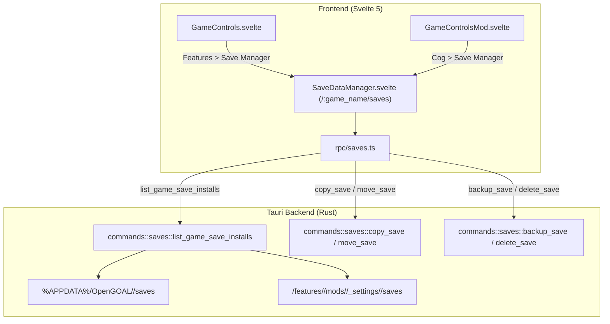

> **Language / Langue :** [🇬🇧 English Version](#-english-version) &nbsp;•&nbsp; [🇫🇷 Version Française](#-version-française)

## Summary / Sommaire

- [🇬🇧 English Version](#-english-version)
  - [1. What This Feature Brings](#1-what-this-feature-brings)
  - [2. How the Feature Works](#2-how-the-feature-works)
  - [3. How it Integrates into the Architecture](#3-how-it-integrates-into-the-architecture)
  - [4. New Files Created](#4-new-files-created)
  - [5. Overview of Changes from the Original Project](#5-overview-of-changes-from-the-original-project)
- [🇫🇷 Version Française](#-version-française)
  - [1. Qu'est-ce qu'elle apporte](#1-quest-ce-quelle-apporte)
  - [2. Comment fonctionne la fonctionnalité](#2-comment-fonctionne-la-fonctionnalité)
  - [3. Comment elle s'intègre dans l'architecture](#3-comment-elle-sintègre-dans-larchitecture)
  - [4. Quels sont les nouveaux fichiers](#4-quels-sont-les-nouveaux-fichiers)
  - [5. Quels sont les modifications dans les grandes lignes](#5-quels-sont-les-modifications-dans-les-grandes-lignes)

---

# 🇬🇧 English Version

## 1. What This Feature Brings

The **Save Data Manager** introduces a comprehensive, safe interface to inspect, copy, move, backup, and delete game saves across all installations of a supported game (the vanilla release and every installed community mod).

### Key Highlights

- **Multi-Install Visibility**: Displays all save slots and active save files for both the vanilla game and installed mods in a single unified dashboard.
- **Milestone & Progress Badging**: Recognizes furthest completed tasks and in-game milestones (e.g. Geyser Rock, Forbidden Jungle) directly on the save cards.
- **Safe Transfers & Automatic Backups**: Allows users to transfer saves between installs with automatic `.bak` creation whenever a file is overwritten.
- **Mod Compatibility Guard ("Big Warning")**: Detects mods known to alter the binary save format (such as _Fishing Legacy_). When selected, a prominent warning alert is displayed, and transfers to/from the vanilla game are strictly blocked to prevent save corruption and crash loops.

```
+-------------------------------------------------------------------------+
| Save Data Manager                                   [Refresh] [Open Folder] |
| Install: [Jak 1 (Vanilla)] [Fishing Legacy (Custom)] [Practice Mod]    |
+-------------------------------------------------------------------------+
| [!] WARNING: Custom Save Format Detected                                |
| This mod alters save file structures. Transfers to/from vanilla are     |
| disabled to protect your save files from corruption.                   |
+-------------------------------------------------------------------------+
| [ Slot 1: Active ]   [ Slot 2: Active ]   [ Slot 3: Empty ]  [ Slot 4 ] |
| Progress: GEYSER     Progress: JUNGLE     (No save file)                |
| Size: 45.2 KB        Size: 45.2 KB                                      |
| [Copy To] [Bk] [Del] [Copy To] [Bk] [Del]                               |
+-------------------------------------------------------------------------+
```

---

## 2. How the Feature Works

### Save Inspection Lifecycle

1. When opening `/:game_name/saves`, the frontend requests all installation directories for the active game via Tauri IPC (`list_game_save_installs`).
2. The Rust backend inspects:
   - Vanilla save directory (`%APPDATA%/OpenGOAL/<game>/saves` on Windows or `~/.config/OpenGOAL/<game>/saves` on Linux).
   - Mod save directories (`<install_dir>/features/<game>/mods/<source>/_settings/<mod>/...`).
3. Save files (`.bin`) are scanned and parsed to determine file size, modification timestamps, slot indices, and completed milestones.
4. Each mod is checked against compatibility rules: if a mod modifies the save structure, it is marked with `hasCustomSaveFormat = true`.

### Transfer & Protection Lifecycle

1. When a user clicks **Copy To...**, a modal allows selecting a destination install and a target slot.
2. If either the source or destination is an incompatible mod and the other is vanilla, the transfer action is **disabled** and an explicit error explanation is presented.
3. If the transfer is valid and the destination slot is occupied, an automatic timestamped backup (`.bak-<timestamp>`) is created before copying the new file.

---

## 3. How it Integrates into the Architecture



- **Frontend Navigation ([src/router.ts](../../src/router.ts))**: Exposes the `/:game_name/saves` route.
- **Entry Points**:
  - Vanilla: Added to the "Features" dropdown menu in [src/components/games/GameControls.svelte](../../src/components/games/GameControls.svelte).
  - Mods: Added to the settings dropdown menu in [src/components/games/GameControlsMod.svelte](../../src/components/games/GameControlsMod.svelte).
- **Backend Handlers ([src-tauri/src/commands/saves.rs](../../src-tauri/src/commands/saves.rs))**: Implements filesystem scanning, milestone parsing, backup generation, and compatibility guards.

---

## 4. New Files Created

1. **`src-tauri/src/commands/saves.rs`**:
   Rust backend module providing save enumeration, slot mapping, milestone calculation, copying, moving, backing up, and deletion.
2. **`src/lib/rpc/saves.ts`**:
   TypeScript wrapper handling typed Tauri command invocations for save operations.
3. **`src/components/saves/SaveDataManager.svelte`**:
   Svelte 5 view rendering the save slots grid, multi-install selector, compatibility warnings, and transfer modals.
4. **`src/lib/rpc/bindings/SaveInstallInfo.ts` & `SaveSlotInfo.ts`**:
   TypeScript bindings automatically generated by `ts-rs`.

---

## 5. Overview of Changes from the Original Project

- **Removed Unsafe CLI Overrides**:
  - Removed the `--disable_save_location_override` CLI injection and `share_vanilla_saves` setting from [src-tauri/src/commands/features/mods.rs](../../src-tauri/src/commands/features/mods.rs) and [src-tauri/src/config.rs](../../src-tauri/src/config.rs).
- **Route & UI Integration**:
  - Registered `/:game_name/saves` in [src/router.ts](../../src/router.ts).
  - Added save manager entry points in [GameControls.svelte](../../src/components/games/GameControls.svelte) and [GameControlsMod.svelte](../../src/components/games/GameControlsMod.svelte).
- **Localization Policy (Crowdin)**:
  - Restricted new translation keys strictly to English ([src/assets/translations/en-US.json](../../src/assets/translations/en-US.json)). Cleaned manual entries from the other 34 language files.

---

# 🇫🇷 Version Française

## 1. Qu'est-ce qu'elle apporte

Le **Gestionnaire de Sauvegardes (_Save Data Manager_)** apporte une interface centralisée, claire et sécurisée permettant de visualiser, copier, déplacer, sauvegarder et supprimer les sauvegardes de jeu entre toutes les installations d'un même jeu (le jeu de base vanilla et l'ensemble des mods communautaires installés).

### Points Clés

- **Vision Multi-Installations** : Affichage dans un tableau de bord unique des 4 slots de sauvegarde du jeu vanilla et de chaque mod installé.
- **Affichage des Jalons et de la Progression** : Détection automatique des tâches accomplies et affichage du jalon le plus avancé (ex. Rocher du Geyser, Jungle Interdite).
- **Transferts Sécurisés et Sauvegardes Automatiques** : Permet de dupliquer ou déplacer des sauvegardes avec génération automatique d'une copie `.bak` horodatée en cas d'écrasement.
- **Protection Anti-Corruption pour les Mods Incompatibles ("Big Warning")** : Identification des mods modifiant la structure binaire des sauvegardes (comme _Fishing Legacy_). Lorsqu'un tel mod est consulté, un bandeau d'alerte très visible s'affiche et les transferts vers/depuis le jeu vanilla sont **strictement désactivés** pour éviter toute corruption de données.

---

## 2. Comment fonctionne la fonctionnalité

### Cycle de consultation

1. À l'ouverture de `/:game_name/saves`, le composant Svelte interroge le backend via la commande Tauri `list_game_save_installs`.
2. Le module Rust analyse :
   - Le dossier vanilla (`%APPDATA%/OpenGOAL/<game>/saves` sous Windows ou `~/.config/OpenGOAL/<game>/saves` sous Linux).
   - Les dossiers des mods (`<install_dir>/features/<game>/mods/<source>/_settings/<mod>/...`).
3. Les fichiers `.bin` sont scannés pour extraire leur taille, date de modification, numéro de slot et nom de jalon.
4. Si un mod altère la structure des sauvegardes, il reçoit le drapeau `hasCustomSaveFormat = true`.

### Cycle de transfert et protection

1. L'utilisateur clique sur **Copier vers...**, ce qui ouvre une modale de destination.
2. Si le transfert implique le jeu vanilla et un mod incompatible, le bouton de confirmation est désactivé et un message d'avertissement explicite est présenté.
3. Si le transfert est valide et que le slot cible est déjà occupé, une sauvegarde automatique `.bak` du fichier existant est créée avant la copie.

---

## 3. Comment elle s'intègre dans l'architecture

- **Navigation Frontend ([src/router.ts](../../src/router.ts))** : Enregistrement de la route `/:game_name/saves`.
- **Points d'accès** :
  - Jeu vanilla : Menu déroulant « Fonctionnalités » de [src/components/games/GameControls.svelte](../../src/components/games/GameControls.svelte).
  - Mods : Menu d'options de [src/components/games/GameControlsMod.svelte](../../src/components/games/GameControlsMod.svelte).
- **Commandes Backend ([src-tauri/src/commands/saves.rs](../../src-tauri/src/commands/saves.rs))** : Gestion du système de fichiers, création de copies de sauvegarde, détection d'incompatibilité et suppression.

---

## 4. Quels sont les nouveaux fichiers

1. **`src-tauri/src/commands/saves.rs`** :
   Module Rust assurant l'énumération des sauvegardes, la copie, le déplacement, les backups et la suppression.
2. **`src/lib/rpc/saves.ts`** :
   Couche RPC TypeScript typée pour appeler les commandes backend.
3. **`src/components/saves/SaveDataManager.svelte`** :
   Interface Svelte 5 affichant les slots, les alertes d'incompatibilité et la modale de transfert.
4. **`src/lib/rpc/bindings/SaveInstallInfo.ts` & `SaveSlotInfo.ts`** :
   Liaisons TypeScript générées automatiquement par `ts-rs`.

---

## 5. Quels sont les modifications dans les grandes lignes

- **Suppression du commutateur en ligne de commande** :
  - Retrait du paramètre dangereux `--disable_save_location_override` et du champ `share_vanilla_saves` dans [src-tauri/src/commands/features/mods.rs](../../src-tauri/src/commands/features/mods.rs) et [src-tauri/src/config.rs](../../src-tauri/src/config.rs).
- **Intégration UI et Route** :
  - Ajout de la route `/:game_name/saves` dans [src/router.ts](../../src/router.ts).
  - Ajout des accès vers le gestionnaire dans [GameControls.svelte](../../src/components/games/GameControls.svelte) et [GameControlsMod.svelte](../../src/components/games/GameControlsMod.svelte).
- **Politique de Traduction (Crowdin)** :
  - Clés ajoutées uniquement dans le fichier anglais ([src/assets/translations/en-US.json](../../src/assets/translations/en-US.json)), nettoyage des 34 autres fichiers de langue pour laisser Crowdin gérer les traductions.
