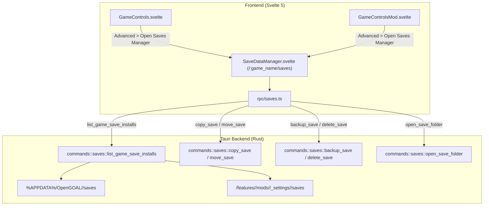

> **Language / Langue :** [🇬🇧 English Version](#-english-version) &nbsp;•&nbsp; [🇫🇷 Version Française](#-version-française)

## Summary / Sommaire

- [🇬🇧 English Version](#-english-version)
  - [1. What This Feature Brings](#1-what-this-feature-brings)
  - [2. How the Feature Works](#2-how-the-feature-works)
  - [3. How it Integrates into the Architecture](#3-how-it-integrates-into-the-architecture)
  - [4. New Files Created](#4-new-files-created)
  - [5. Overview of Changes from the Original Project](#5-overview-of-changes-from-the-original-project)
- [🇫🇷 Version Française](#-version-française)
  - [1. Qu'est-ce qu'elle apporte](#1-quest-ce-quelle-apporte)
  - [2. Comment fonctionne la fonctionnalité](#2-comment-fonctionne-la-fonctionnalité)
  - [3. Comment elle s'intègre dans l'architecture](#3-comment-elle-sintègre-dans-larchitecture)
  - [4. Quels sont les nouveaux fichiers](#4-quels-sont-les-nouveaux-fichiers)
  - [5. Quels sont les modifications dans les grandes lignes](#5-quels-sont-les-modifications-dans-les-grandes-lignes)

---

# 🇬🇧 English Version

## 1. What This Feature Brings

The **Saves Manager** introduces a comprehensive, safe, and intuitive interface to inspect, copy, move, backup, and delete game saves across all installations of supported OpenGOAL games (vanilla base games and every installed community mod).

### Key Highlights

- **Multi-Game Selection**: Switch seamlessly between Jak 1, Jak 2, and Jak 3 directly inside the Saves Manager interface via a top selector bar.
- **Regional Save Folders & Subdirectories**: Supports OpenGOAL's regional folder structure (e.g. `BASCUS-97265AYBABTU!`, `BESCES-51608AYBABTU!`). Users can browse regional folders and inspect slot cards within each folder.
- **Multi-Install Visibility**: Displays save slots for both the vanilla game and installed mods with dedicated status indicators and badges.
- **Milestone & Progress Recognition**: Displays furthest completed tasks and in-game milestones (e.g. Geyser Rock, Forbidden Jungle) directly on the save slot cards.
- **Safe Transfers & Automatic Backups**: Allows copying or moving saves between installations, automatically generating timestamped `.bak` files upon overwrite.
- **Accidental Deletion Protection**: Includes a confirmation modal before deleting any save file to prevent data loss.
- **Action Tooltips & Unified Styling**: Rich tooltips on hover for every button and consistent amber/orange styling (`bg-amber-500 hover:bg-amber-600`) across all confirmation and action buttons.

```
+-------------------------------------------------------------------------+
| Saves Manager                                       [Refresh] [Open Folder] |
| Game: [Jak & Daxter] [Jak II] [Jak 3]                                   |
| Install: [Vanilla Game] [Blue Krimzon Guard (Mod)]                      |
+-------------------------------------------------------------------------+
| Folders: [ BASCUS-97265AYBABTU! ]  [ BESCES-51608AYBABTU! ]             |
+-------------------------------------------------------------------------+
| [ Slot 1: Active ]   [ Slot 2: Active ]   [ Slot 3: Empty ]  [ Slot 4 ] |
| Progress: GEYSER     Progress: JUNGLE     (No save file)                |
| Size: 45.2 KB        Size: 45.2 KB                                      |
| [Copy/Move] [Bk] [Del]                                                  |
+-------------------------------------------------------------------------+
```

---

## 2. How the Feature Works

### Save Inspection & Folder Lifecycle

1. When opening the Saves Manager (`/:game_name/saves`), the frontend queries installations for the selected game via `list_game_save_installs`.
2. The Rust backend inspects:
   - Vanilla save directory (`%APPDATA%/OpenGOAL/<game>/saves` on Windows or `~/.config/OpenGOAL/<game>/saves` on Linux).
   - Mod save directories (`<install_dir>/features/<game>/mods/<source>/_settings/<mod>/...`).
3. Discovered directories are scanned for regional folders (`BASCUS-*`, `BESCES-*`, `default`).
4. Save files (`.bin`) within each folder are parsed to determine file size, modification timestamps, slot indices, and completed milestones.

### Transfer, Backup & Deletion Lifecycle

1. **Copy / Move**: When clicking **Copy To...**, a modal lets users select the destination install, target folder, and target slot. Users can toggle whether to move (delete source) or copy. If the destination slot is occupied, an automatic timestamped backup (`.bak-<timestamp>`) is created.
2. **Backup**: Creates a standalone timestamped backup of the selected save slot.
3. **Delete**: Triggers a safety confirmation modal to confirm deletion before invoking `delete_save`.
4. **Open Folder**: Launches the native file explorer to inspect the current save folder via `open_save_folder`.

---

## 3. How it Integrates into the Architecture



- **Frontend Navigation ([src/router.ts](../../src/router.ts))**: Exposes routes `/:game_name/saves` and `/:game_name/mods/:source_name/:mod_name/saves`.
- **Entry Points**:
  - Vanilla: Added to the "Advanced" dropdown menu in [src/components/games/GameControls.svelte](../../src/components/games/GameControls.svelte) as "Open Saves Manager".
  - Mods: Added to the "Advanced" dropdown menu in [src/components/games/GameControlsMod.svelte](../../src/components/games/GameControlsMod.svelte) as "Open Saves Manager".
- **Backend Handlers ([src-tauri/src/commands/saves.rs](../../src-tauri/src/commands/saves.rs))**: Implements save directory scanning, regional subfolder discovery, milestone calculation, backup generation, copying, moving, and deletion.

---

## 4. New Files Created

1. **`src-tauri/src/commands/saves.rs`**:
   Rust backend module providing save enumeration, regional folder hierarchy resolution, milestone parsing, backup generation, and file operations.
2. **`src/lib/rpc/saves.ts`**:
   TypeScript wrapper handling typed Tauri command invocations for save operations.
3. **`src/components/saves/SaveDataManager.svelte`**:
   Svelte 5 view rendering the game switcher bar, regional folders, save slots grid, action tooltips, and transfer/delete modals.
4. **`src/lib/rpc/bindings/SaveInstallInfo.ts`**, **`SaveFolderInfo.ts`** & **`SaveSlotInfo.ts`**:
   TypeScript bindings automatically generated by `ts-rs`.

---

## 5. Overview of Changes from the Original Project

- **Access Point Migration**:
  - Moved entry points from "Features" / Cog into the "Advanced" dropdown menu under the name "Open Saves Manager" for both base games and mods.
- **Regional Folders & Game Switcher**:
  - Replaced the single-directory view with a two-level hierarchy supporting multiple regional folders (`BASCUS-*`, `BESCES-*`) and in-screen game switching.
- **Safety & UX**:
  - Added delete confirmation popups and informative tooltips across all interactive actions.
  - Unified color scheme with amber/orange action buttons.
- **Localization Policy (Crowdin)**:
  - Added new strings exclusively to [src/assets/translations/en-US.json](../../src/assets/translations/en-US.json). Kept other language files clean for Crowdin synchronization.

---

# 🇫🇷 Version Française

## 1. Qu'est-ce qu'elle apporte

Le **Gestionnaire de Sauvegardes (_Saves Manager_)** apporte une interface centralisée, intuitive et sécurisée permettant de consulter, copier, déplacer, sauvegarder et supprimer les sauvegardes de jeu pour l'ensemble des installations OpenGOAL (jeux de base vanilla et mods communautaires installés).

### Points Clés

- **Sélecteur Multi-Jeux** : Basculement direct et fluide entre Jak 1, Jak 2 et Jak 3 via une barre de sélection intégrée en haut de l'écran.
- **Dossiers Régionaux et Sous-Dossiers** : Prise en charge des dossiers régionaux OpenGOAL (ex. `BASCUS-97265AYBABTU!`, `BESCES-51608AYBABTU!`). L'utilisateur sélectionne un dossier régional pour visualiser ses slots spécifiques.
- **Vision Multi-Installations** : Affichage des sauvegardes du jeu vanilla et de chaque mod installé avec badges d'identification.
- **Affichage des Jalons et de la Progression** : Détection automatique des tâches accomplies et affichage du jalon le plus avancé (ex. Rocher du Geyser, Jungle Interdite).
- **Transferts Sécurisés et Sauvegardes Automatiques** : Duplication ou déplacement de sauvegardes entre installations avec génération automatique d'une copie de secours `.bak` horodatée en cas d'écrasement.
- **Protection Anti-Suppression Accidentelle** : Modale de confirmation avant toute suppression définitive.
- **Info-Bulles et Palette Orange Harmonisée** : Info-bulles explicatives au survol de chaque bouton et boutons d'action stylisés en orange ambré (`bg-amber-500 hover:bg-amber-600`).

---

## 2. Comment fonctionne la fonctionnalité

### Cycle de consultation et dossiers régionaux

1. À l'ouverture du Saves Manager (`/:game_name/saves`), le composant interroge le backend via la commande Tauri `list_game_save_installs`.
2. Le module Rust analyse :
   - Le dossier vanilla (`%APPDATA%/OpenGOAL/<game>/saves` sous Windows ou `~/.config/OpenGOAL/<game>/saves` sous Linux).
   - Les dossiers des mods (`<install_dir>/features/<game>/mods/<source>/_settings/<mod>/...`).
3. Les sous-dossiers régionaux sont identifiés (`BASCUS-*`, `BESCES-*`, `default`).
4. Les fichiers `.bin` de chaque dossier sont analysés pour extraire leur taille, date de modification, numéro de slot et jalon atteint.

### Cycle de transfert, backup et suppression

1. **Copie / Déplacement** : Un clic sur **Copier vers...** ouvre une modale permettant de choisir l'installation, le dossier et le slot cible, avec option de déplacement (suppression de la source). Si la destination est occupée, une sauvegarde `.bak-<timestamp>` est créée automatiquement.
2. **Sauvegarde manuelle (Backup)** : Génère une copie horodatée indépendante du slot sélectionné.
3. **Suppression** : Affiche une boîte de dialogue de confirmation avant d'exécuter `delete_save`.
4. **Ouvrir le dossier** : Ouvre l'explorateur de fichiers natif sur le dossier de sauvegarde actif via `open_save_folder`.

---

## 3. Comment elle s'intègre dans l'architecture

- **Navigation Frontend ([src/router.ts](../../src/router.ts))** : Enregistrement des routes `/:game_name/saves` et `/:game_name/mods/:source_name/:mod_name/saves`.
- **Points d'accès** :
  - Jeu vanilla : Menu déroulant « Advanced » de [src/components/games/GameControls.svelte](../../src/components/games/GameControls.svelte) via l'option « Open Saves Manager ».
  - Mods : Menu déroulant « Advanced » de [src/components/games/GameControlsMod.svelte](../../src/components/games/GameControlsMod.svelte) via l'option « Open Saves Manager ».
- **Commandes Backend ([src-tauri/src/commands/saves.rs](../../src-tauri/src/commands/saves.rs))** : Énumération des sauvegardes et dossiers régionaux, calcul des jalons, backups automatiques, copie, déplacement et suppression.

---

## 4. Quels sont les nouveaux fichiers

1. **`src-tauri/src/commands/saves.rs`** :
   Module Rust assurant l'énumération des dossiers régionaux, la copie, le déplacement, les backups et la suppression.
2. **`src/lib/rpc/saves.ts`** :
   Couche RPC TypeScript typée pour appeler les commandes backend.
3. **`src/components/saves/SaveDataManager.svelte`** :
   Interface Svelte 5 affichant la barre de sélection de jeu, les dossiers régionaux, la grille de slots et les modales de confirmation.
4. **`src/lib/rpc/bindings/SaveInstallInfo.ts`**, **`SaveFolderInfo.ts`** & **`SaveSlotInfo.ts`** :
   Liaisons TypeScript générées automatiquement par `ts-rs`.

---

## 5. Quels sont les modifications dans les grandes lignes

- **Déplacement des points d'accès** :
  - Les accès ont été déplacés dans le menu déroulant « Advanced » avec le libellé « Open Saves Manager » sur le jeu de base et sur les mods.
- **Hiérarchie régionale et sélecteur de jeu** :
  - Ajout de la sélection de jeu intégrée et du niveau d'arborescence des dossiers régionaux (`BASCUS-*`, `BESCES-*`).
- **Sécurité et Ergonomie** :
  - Ajout d'une pop-up de confirmation pour la suppression, info-bulles descriptives sur les boutons et harmonisation de la charte graphique en orange.
- **Politique de Traduction (Crowdin)** :
  - Clés de traduction ajoutées uniquement dans le fichier anglais ([src/assets/translations/en-US.json](../../src/assets/translations/en-US.json)), préservant ainsi le workflow de synchronisation Crowdin.
