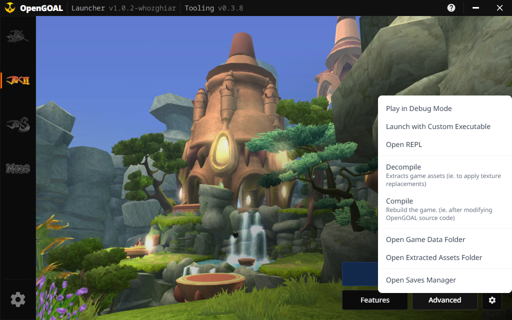
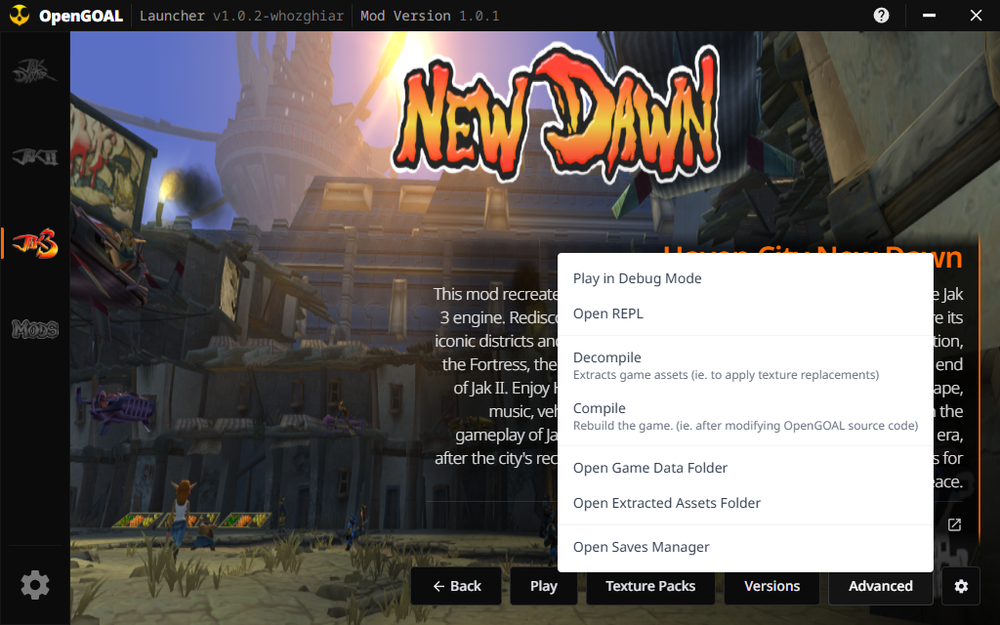
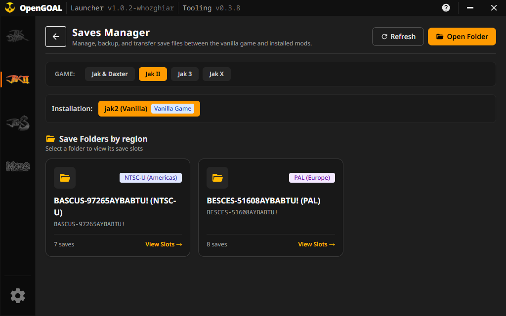
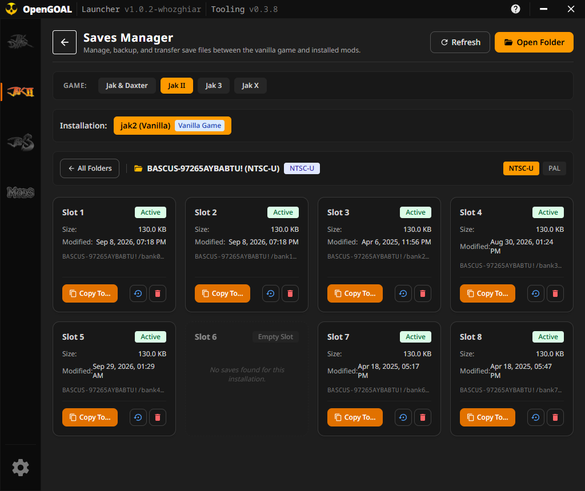
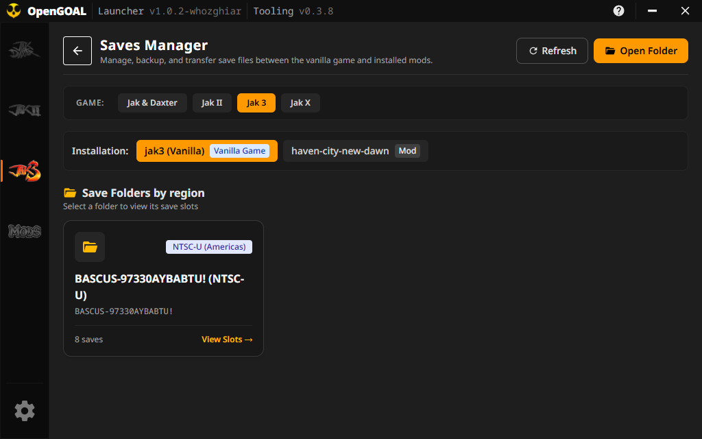
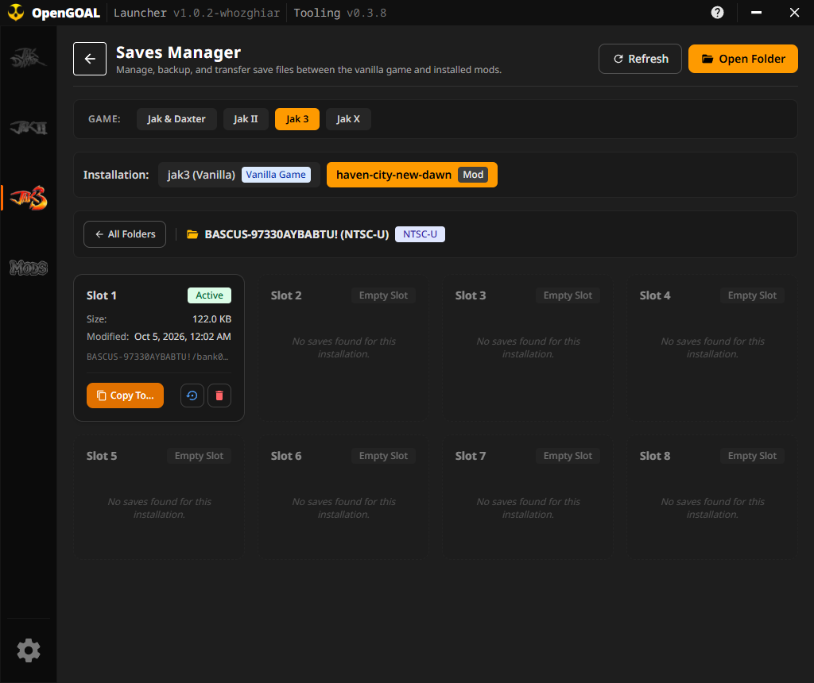
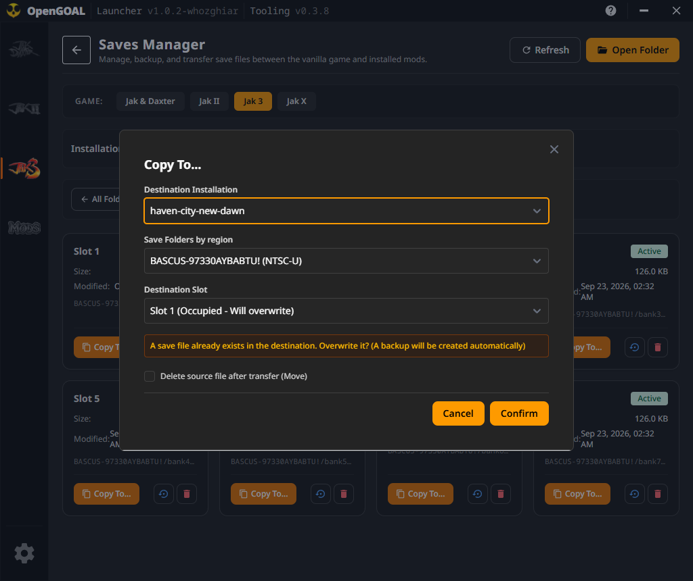
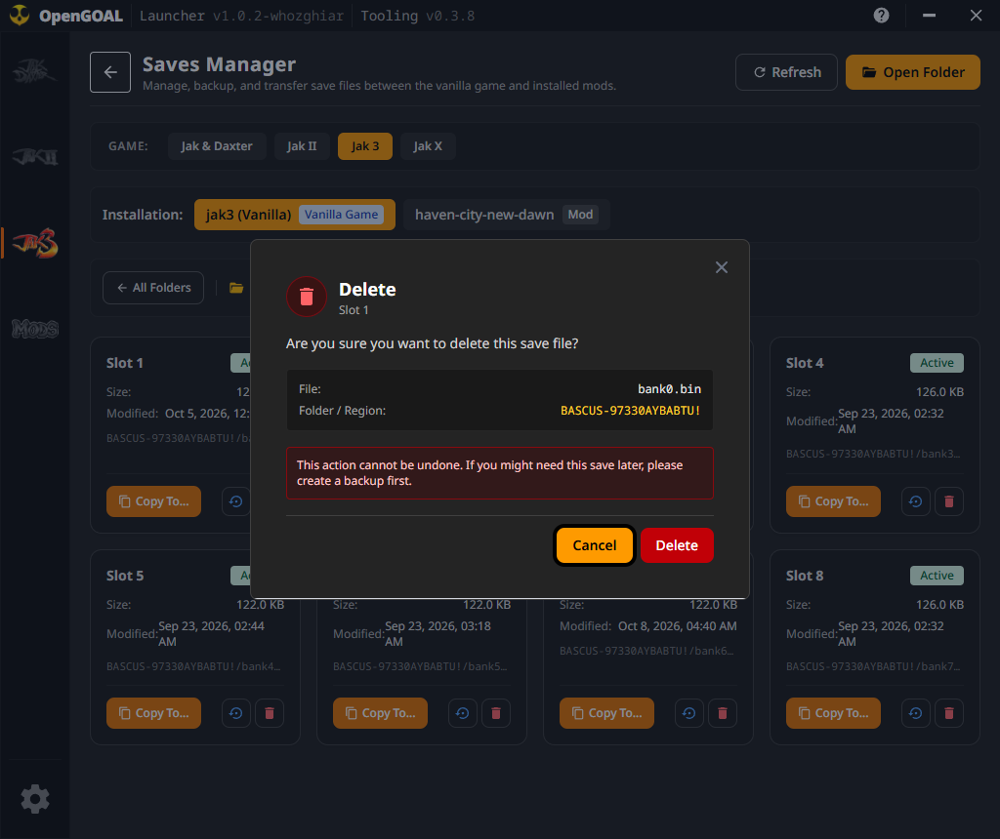
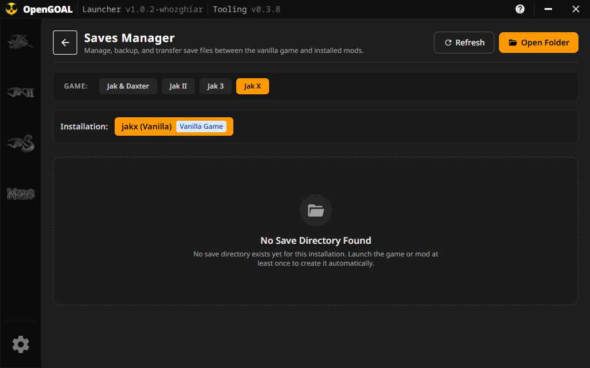

# Saves Manager

The Saves Manager lists the save files of every OpenGOAL game and every installed mod on one screen. From there you can copy, move, back up or delete a save without opening a file explorer.

Screenshots in this document come from launcher 1.0.2 built from `master-dev`, on Windows.

## Contents

- [1. What this feature brings](#1-what-this-feature-brings)
- [2. How the feature works](#2-how-the-feature-works)
- [3. How it integrates into the architecture](#3-how-it-integrates-into-the-architecture)
- [4. New files created](#4-new-files-created)
- [5. Overview of changes from the original project](#5-overview-of-changes-from-the-original-project)

## 1. What this feature brings

Each installation keeps its saves in a different folder:

- The base game writes to `%APPDATA%\OpenGOAL\<game>\saves` on Windows and `~/.config/OpenGOAL/<game>/saves` on Linux.
- Each mod is launched with its own settings folder, so its saves live in `<install dir>/features/<game>/mods/<source>/_settings/<mod>/OpenGOAL/<game>/saves`. This keeps mod saves away from the base game, but it also hides them.

Before this feature, comparing saves or moving one from the base game to a mod meant finding both folders by hand and renaming files.

The Saves Manager adds:

- One list of saves for the base game and for every installed mod, for Jak and Daxter, Jak II, Jak 3 and Jak X.
- Saves grouped by region folder (NTSC-U, PAL, NTSC-J).
- Copy and move between installations, with the choice of destination folder and slot.
- An automatic backup of any save that a transfer would overwrite.
- A manual backup button and a delete button that asks for confirmation.
- A button that opens the current save folder in the system file explorer.

What it does not do: it does not read the content of a save, so it shows no progress or completion data. It only shows file size and last modification date.

## 2. How the feature works

### Opening the screen

From the page of an installed game, hover **Advanced** and choose **Open Saves Manager**.

The same entry exists on the page of an installed mod. The screen then opens with that mod already selected. The **Advanced** button is disabled while the mod is not installed.

### Choosing a game, an installation and a region folder

The screen is organised in three levels, from top to bottom:

1. **Game**: Jak and Daxter, Jak II, Jak 3 or Jak X. Changing the game resets the installation to the base game.
2. **Installation**: the base game (blue **Vanilla Game** badge) and one entry per installed mod of that game (grey **Mod** badge).
3. **Save Folders by region**: one card per folder found in the save directory.

The game stores saves in a folder named after the disc serial number, such as `BASCUS-97265AYBABTU!`. The launcher reads the region from that name:

| Folder name contains | Region            |
| :------------------- | :---------------- |
| `BASCUS` or `SCUS`   | NTSC-U (Americas) |
| `BESCES` or `SCES`   | PAL (Europe)      |
| `SCPS`               | NTSC-J (Japan)    |
| anything else        | Custom Region     |

Click **View Slots** on a card to open that folder. Save files placed directly in the `saves` folder, outside any subfolder, are not listed.

### Reading the slots

Inside a folder, every slot of the game is drawn as a card: 4 slots for Jak and Daxter, 8 for the other games.

A card shows:

- The slot number, taken from the file name (`bank0.bin` is slot 1; `jak1-game-0.bin` is slot 1 for Jak and Daxter).
- A green **Active** badge when a save file exists, or **Empty Slot** with a dashed border when it does not.
- The file size, the last modification date and the path of the file inside the save directory.
- Three buttons: **Copy To...**, the circular arrow (backup) and the trash can (delete).

At the top of the folder view, **All Folders** returns to the region list. When the installation has several region folders, tabs on the right switch between them directly.

Use **Refresh** after playing to reload the files from disk.

### Comparing the base game with a mod

Select another installation to see its saves for the same game. Jak 3 below has the base game and the mod `haven-city-new-dawn`.

The mod has its own saves, independent from the base game. Here it holds a single save in slot 1.

### Copying or moving a save

Click **Copy To...** on a save. A dialog asks where to put it.

- **Destination Installation**: any other installation of the same game.
- **Save Folders by region**: the folder in the destination. A folder from a different region is greyed out and marked `Incompatible`. If the destination has no folder of the same region as the save, a red message explains that cross-region transfers are blocked to avoid corrupting the save, and **Confirm** is disabled.
- **Destination Slot**: slots that already hold a save are marked `Occupied - Will overwrite`, and an orange message confirms that a backup will be created.
- **Delete source file after transfer (Move)**: when ticked, the dialog becomes **Move To...** and the original is deleted once the copy succeeds.

Click **Confirm** to run the transfer. If the destination slot was occupied, the old file is first copied next to itself as `<name>.bak-<timestamp>`.

### Backing up a save

The circular arrow button copies the save in place as `<name>.bak-<timestamp>`, where the timestamp is the time of the backup in seconds since 1 January 1970. A message shows the name of the backup. Backups are not listed in the Saves Manager. To restore one, open the folder with **Open Folder** and rename the backup back to the original name.

### Deleting a save

The trash can button opens a confirmation dialog that names the file and its folder. **Cancel** is selected by default.

The file is removed for good; it does not go to the recycle bin. Make a backup first if you may need it.

### Installations without a save folder

If the game or mod has never been launched, its save folder does not exist yet and the screen says so.

Launch the game once and press **Refresh**.

### Opening the folder

**Open Folder**, at the top right, opens the current save directory in the system file explorer. If a region folder is selected, it opens that folder. The folder is created if it does not exist.

## 3. How it integrates into the architecture

The feature follows the usual launcher layering: a Svelte screen calls typed wrapper functions, which call Tauri commands written in Rust, which work on the file system.

### Entry points and routes

- [GameControls.svelte](../../src/components/games/GameControls.svelte) and [GameControlsMod.svelte](../../src/components/games/GameControlsMod.svelte) each add an **Open Saves Manager** item to their **Advanced** menu.
- [router.ts](../../src/router.ts) maps `/:game_name/saves` and `/:game_name/mods/:source_name/:mod_name/saves` to the same component. The mod route is what preselects the mod.

### Frontend

[SaveDataManager.svelte](../../src/components/saves/SaveDataManager.svelte) holds the whole screen: game selector, installation selector, region folders, slot grid, transfer dialog and delete dialog. It never touches the disk itself. It calls the functions of [saves.ts](../../src/lib/rpc/saves.ts).

### Backend

[saves.rs](../../src-tauri/src/commands/saves.rs) exposes six commands, registered in [main.rs](../../src-tauri/src/main.rs):

| Command                   | What it does                                                                                                                                                       |
| :------------------------ | :----------------------------------------------------------------------------------------------------------------------------------------------------------------- |
| `list_game_save_installs` | Scans the base game and every installed mod of a game and returns installations, region folders and save files. Only `.bin` files are listed, up to 3 levels deep. |
| `copy_save`               | Copies a save to another installation, folder and slot. Refuses a transfer between two different regions. Backs up the destination file first if it exists.        |
| `move_save`               | Runs `copy_save`, then deletes the source. A failed copy leaves the source untouched.                                                                              |
| `backup_save`             | Copies a save to `<name>.bak-<timestamp>` in the same folder.                                                                                                      |
| `delete_save`             | Deletes a save file.                                                                                                                                               |
| `open_save_folder`        | Opens the save directory in the system file explorer.                                                                                                              |

The save directory of an installation is resolved in one place:

- Base game: the `OpenGOAL/<game>/saves` folder inside the user's config directory.
- Mod: `<install dir>/features/<game>/mods/<source>/_settings/<mod>/OpenGOAL/<game>/saves`. If that folder does not exist but `_settings/<mod>/saves` does, the second one is used.

Mods are launched with `--config-path <mod settings dir>`, which is why their saves sit in that folder. The Saves Manager only reads and writes files there. It does not change how the game or the mods behave.

### Types

`SaveInstallInfo`, `SaveFolderInfo` and `SaveSlotInfo` are defined in Rust. `ts-rs` generates their TypeScript versions in [src/lib/rpc/bindings/](../../src/lib/rpc/bindings/). These generated files are never edited by hand.

### Text

New strings were added only to [en-US.json](../../src/assets/translations/en-US.json). The other languages are managed by Crowdin.

## 4. New files created

- [src-tauri/src/commands/saves.rs](../../src-tauri/src/commands/saves.rs): the six commands above and the region and slot detection.
- [src/lib/rpc/saves.ts](../../src/lib/rpc/saves.ts): typed wrappers around the Tauri commands.
- [src/components/saves/SaveDataManager.svelte](../../src/components/saves/SaveDataManager.svelte): the screen.
- [SaveInstallInfo.ts](../../src/lib/rpc/bindings/SaveInstallInfo.ts), [SaveFolderInfo.ts](../../src/lib/rpc/bindings/SaveFolderInfo.ts), [SaveSlotInfo.ts](../../src/lib/rpc/bindings/SaveSlotInfo.ts): types generated by `ts-rs`.
- [docs/img/save_data_manager/](../img/save_data_manager/): the screenshots used in this document.

## 5. Overview of changes from the original project

- **Routing**: [router.ts](../../src/router.ts) gains the two `saves` routes.
- **Game and mod pages**: the **Advanced** menus of [GameControls.svelte](../../src/components/games/GameControls.svelte) and [GameControlsMod.svelte](../../src/components/games/GameControlsMod.svelte) gain **Open Saves Manager**.
- **Backend**: [main.rs](../../src-tauri/src/main.rs) registers the six new commands.
- **Translations**: `gameControls_button_saveManager` and the `saveManager_*` keys were added to [en-US.json](../../src/assets/translations/en-US.json).
