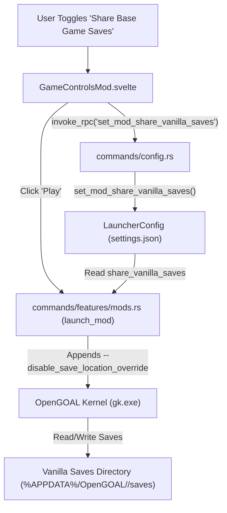
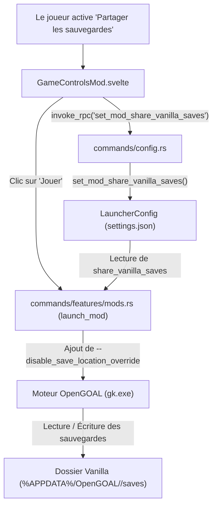

> **Language / Langue :** [🇬🇧 English Version](#-english-version) &nbsp;•&nbsp; [🇫🇷 Version Française](#-version-française)

## Summary / Sommaire

- [🇬🇧 English Version](#-english-version)
  - [1. What This Feature Brings](#1-what-this-feature-brings)
  - [2. How the Feature Works](#2-how-the-feature-works)
  - [3. How it Integrates into the Architecture](#3-how-it-integrates-into-the-architecture)
  - [4. New Files Created](#4-new-files-created)
  - [5. Overview of Changes from the Original Project](#5-overview-of-changes-from-the-original-project)
- [🇫🇷 Version Française](#-version-française)
  - [1. Qu'est-ce qu'elle apporte](#1-quest-ce-quelle-apporte)
  - [2. Comment fonctionne la fonctionnalité](#2-comment-fonctionne-la-fonctionnalité)
  - [3. Comment elle s'intègre dans l'architecture](#3-comment-elle-sintègre-dans-larchitecture)
  - [4. Quels sont les nouveaux fichiers](#4-quels-sont-les-nouveaux-fichiers)
  - [5. Quels sont les modifications dans les grandes lignes](#5-quels-sont-les-modifications-dans-les-grandes-lignes)

---

# 🇬🇧 English Version

## 1. What This Feature Brings

By default in the OpenGOAL Launcher, every community mod runs in strict isolation. While this prevents mods from conflicting with the base game, it also isolates game saves. Players who want to play a mod that preserves original gameplay (such as difficulty balance mods, texture overhaul mods, or quality-of-life enhancements) often want to continue from their vanilla save file rather than starting the game over from scratch.

This feature brings:

1. **Seamless Save Sharing**: Players can configure any installed mod to read and write directly to the base game (vanilla) save files.
2. **Per-Mod Toggle**: Save sharing is completely optional and configured individually per mod via a simple switch in the mod settings menu.
3. **Smart Folder Access**: The "Open Saves Folder" button dynamically routes to the vanilla saves folder when sharing is enabled, or to the isolated mod folder when disabled.

---

## 2. How the Feature Works

1. **User Activation**:
   - The user navigates to an installed mod page and clicks the settings cog icon.
   - A toggle switch titled "Share Base Game Saves" allows enabling or disabling shared saves with a single click.
2. **Preference Persistence**:
   - The toggle calls the backend RPC `set_mod_share_vanilla_saves`, which updates the mod's configuration entry (`shareVanillaSaves: true/false`) in `settings.json`.
3. **Execution Runtime Argument**:
   - When launching the mod, the launcher checks the `shareVanillaSaves` boolean.
   - If enabled, the launcher appends `--disable_save_location_override` to the OpenGOAL runtime (`gk`) arguments before the `--` delimiter.
   - OpenGOAL keeps using `--config-path` for mod-isolated settings, but stores save files in `%APPDATA%/OpenGOAL/<game>/saves` (Windows) or `~/.config/OpenGOAL/<game>/saves` (Linux).
4. **Dynamic Folder Resolution**:
   - In the frontend, clicking "Open Saves Folder" automatically opens the active save directory corresponding to the current toggle state.

---

## 3. How it Integrates into the Architecture

The feature integrates cleanly across the frontend, backend configuration, and runtime launch pipeline:

- **Configuration Layer ([src-tauri/src/config.rs](../../src-tauri/src/config.rs))**: Extends `InstalledMod` with `share_vanilla_saves: bool` (defaulting to `false`) to ensure full backwards compatibility.
- **IPC Command Layer ([src-tauri/src/commands/config.rs](../../src-tauri/src/commands/config.rs))**: Exposes `set_mod_share_vanilla_saves` to save changes asynchronously.
- **CLI Pipeline ([src-tauri/src/commands/features/mods.rs](../../src-tauri/src/commands/features/mods.rs))**: Injects `--disable_save_location_override` into `generate_launch_mod_args` before kernel arguments (`--`).

---

## 4. New Files Created

- [docs/features_ai/features_shared_saves.md](./features_shared_saves.md): This bilingual documentation document.

---

## 5. Overview of Changes from the Original Project

- **Backend Configuration Model ([src-tauri/src/config.rs](../../src-tauri/src/config.rs))**:
  - Added `share_vanilla_saves` field to `InstalledMod`.
  - Added `get_supported_game_config`, `get_mod_share_vanilla_saves`, and `set_mod_share_vanilla_saves` methods to `LauncherConfig`.
- **Backend Commands ([src-tauri/src/commands/config.rs](../../src-tauri/src/commands/config.rs), [src-tauri/src/main.rs](../../src-tauri/src/main.rs))**:
  - Added and registered the `set_mod_share_vanilla_saves` command handler.
- **Mod Execution Pipeline ([src-tauri/src/commands/features/mods.rs](../../src-tauri/src/commands/features/mods.rs))**:
  - Updated `generate_launch_mod_args`, `launch_mod`, and `get_launch_mod_string` to inspect `share_vanilla_saves` and pass `--disable_save_location_override`.
- **Frontend RPC Client ([src/lib/rpc/config.ts](../../src/lib/rpc/config.ts))**:
  - Added `setModShareVanillaSaves` helper function.
- **Frontend UI Controls ([src/components/games/GameControlsMod.svelte](../../src/components/games/GameControlsMod.svelte))**:
  - Added the toggle item inside the mod settings dropdown.
  - Dynamically switches `savesDir` between vanilla and mod save folders.

---

# 🇫🇷 Version Française

## 1. Qu'est-ce qu'elle apporte

Par défaut dans le launcher OpenGOAL, chaque mod communautaire s'exécute de façon strictement isolée. Si cela prévient tout conflit avec le jeu de base, cela isole également les fichiers de sauvegarde. Les joueurs souhaitant profiter d'un mod respectant le contenu original (mod de rééquilibrage, pack de textures HD ou améliorations de confort) souhaitent souvent continuer leur partie officielle sans devoir tout recommencer à zéro.

Cette fonctionnalité apporte :

1. **Partage Transparent des Sauvegardes** : possibilité pour chaque mod installé de lire et d'écrire directement dans les fichiers de sauvegarde du jeu officiel (vanilla).
2. **Activation Modulaire par Mod** : le partage est totalement optionnel et s'active au cas par cas pour chaque mod via un simple interrupteur dans le menu de réglages du mod.
3. **Accès Intelligent au Dossier de Sauvegarde** : le bouton "Ouvrir le dossier des sauvegardes" s'adapte en temps réel : il ouvre le dossier vanilla lorsque le partage est actif, ou le dossier propre au mod lorsqu'il est désactivé.

---

## 2. Comment fonctionne la fonctionnalité

1. **Activation par le Joueur** :
   - Le joueur se rend sur la page d'un mod installé et clique sur l'icône d'engrenage (paramètres).
   - Un interrupteur interactif intitulé "Partager les sauvegardes du jeu de base" permet d'activer ou désactiver l'option d'un simple clic.
2. **Mémorisation du Choix** :
   - L'action appelle la commande backend RPC `set_mod_share_vanilla_saves`, qui enregistre la préférence (`shareVanillaSaves: true/false`) dans le fichier `settings.json`.
3. **Argument d'Exécution Transmis au Moteur** :
   - Lors du lancement du mod, le launcher vérifie l'état de `shareVanillaSaves`.
   - S'il est actif, le launcher ajoute le paramètre `--disable_save_location_override` à l'exécutable OpenGOAL (`gk`) avant le séparateur `--`.
   - OpenGOAL conserve ainsi le dossier isolé `--config-path` pour les réglages du mod, mais dirige la lecture/écriture des sauvegardes vers `%APPDATA%/OpenGOAL/<game>/saves` (Windows) ou `~/.config/OpenGOAL/<game>/saves` (Linux).
4. **Mise à Jour Dynamique de l'Explorateur** :
   - Dans l'interface, le bouton "Ouvrir le dossier des sauvegardes" cible instantanément le bon répertoire selon l'état du réglage.

---

## 3. Comment elle s'intègre dans l'architecture

La fonctionnalité s'intègre harmonieusement dans les couches de l'application :

- **Couche Configuration ([src-tauri/src/config.rs](../../src-tauri/src/config.rs))** : Ajout du champ `share_vanilla_saves: bool` (par défaut à `false`) dans la structure `InstalledMod` pour garantir une rétrocompatibilité totale.
- **Couche Commandes IPC ([src-tauri/src/commands/config.rs](../../src-tauri/src/commands/config.rs))** : Exposition de la commande `set_mod_share_vanilla_saves`.
- **Pipeline d'Exécution ([src-tauri/src/commands/features/mods.rs](../../src-tauri/src/commands/features/mods.rs))** : Injection de l'argument CLI `--disable_save_location_override` dans `generate_launch_mod_args`.

---

## 4. Quels sont les nouveaux fichiers

- [docs/features_ai/features_shared_saves.md](./features_shared_saves.md) : Ce document de référence bilingue.

---

## 5. Quels sont les modifications dans les grandes lignes

- **Modèle de Configuration Backend ([src-tauri/src/config.rs](../../src-tauri/src/config.rs))** :
  - Ajout de `share_vanilla_saves` dans la structure `InstalledMod`.
  - Ajout des méthodes `get_supported_game_config`, `get_mod_share_vanilla_saves` et `set_mod_share_vanilla_saves`.
- **Commandes Backend ([src-tauri/src/commands/config.rs](../../src-tauri/src/commands/config.rs), [src-tauri/src/main.rs](../../src-tauri/src/main.rs))** :
  - Déclaration et enregistrement de `set_mod_share_vanilla_saves`.
- **Pipeline de Lancement ([src-tauri/src/commands/features/mods.rs](../../src-tauri/src/commands/features/mods.rs))** :
  - Prise en compte du réglage et ajout de `--disable_save_location_override` lors du lancement du mod et de la génération de la commande de débogage.
- **Client RPC Frontend ([src/lib/rpc/config.ts](../../src/lib/rpc/config.ts))** :
  - Ajout de la fonction `setModShareVanillaSaves`.
- **Interface Utilisateur ([src/components/games/GameControlsMod.svelte](../../src/components/games/GameControlsMod.svelte))** :
  - Ajout du commutateur interactif dans le menu de configuration du mod.
  - Actualisation dynamique du chemin du dossier de sauvegarde.
